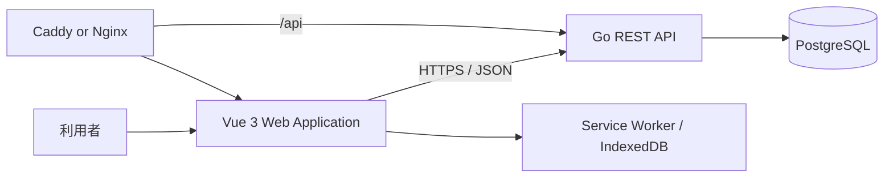
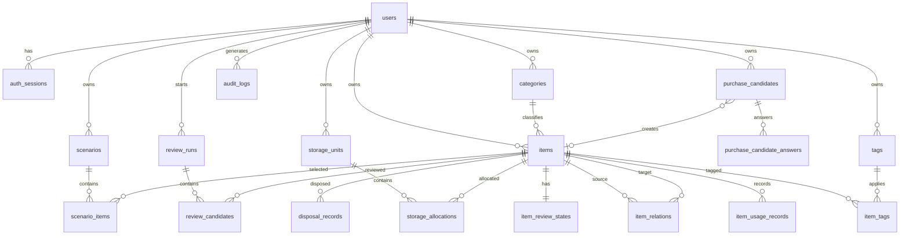

# LESS 詳細設計書

---

## 目次

1. [概要](#1-概要)
2. [設計の前提](#2-設計の前提)
3. [システム構成](#3-システム構成)
4. [技術構成](#4-技術構成)
5. [フォルダ構成](#5-フォルダ構成)
6. [命名規則](#6-命名規則)
7. [業務概念とドメインモデル](#7-業務概念とドメインモデル)
8. [機能一覧](#8-機能一覧)
9. [画面設計](#9-画面設計)
10. [フロントエンド設計](#10-フロントエンド設計)
11. [バックエンド設計](#11-バックエンド設計)
12. [REST-API設計](#12-rest-api設計)
13. [データベース設計](#13-データベース設計)
14. [所有見直し判定ロジック](#14-所有見直し判定ロジック)
15. [購入前審査ロジック](#15-購入前審査ロジック)
16. [収納・移動管理](#16-収納移動管理)
17. [シナリオ・持ち物リスト](#17-シナリオ持ち物リスト)
18. [認証・認可](#18-認証認可)
19. [エラーハンドリング](#19-エラーハンドリング)
20. [トランザクション設計](#20-トランザクション設計)
21. [インポート・エクスポート](#21-インポートエクスポート)
22. [監査ログ](#22-監査ログ)
23. [非機能要件](#23-非機能要件)
24. [セキュリティ設計](#24-セキュリティ設計)
25. [テスト設計](#25-テスト設計)
26. [ローカル開発環境](#26-ローカル開発環境)
27. [CI・CD](#27-cicd)
28. [実装フェーズ](#28-実装フェーズ)
29. [AI駆動開発ルール](#29-ai駆動開発ルール)
30. [レビュー用チェックリスト](#30-レビュー用チェックリスト)
31. [将来拡張](#31-将来拡張)

---

## 1. 概要

### 1.1 アプリケーション名

仮称を **LESS** とする。

### 1.2 目的

LESSは、ミニマリストが所有物を単に一覧化するのではなく、以下を一つの判断体系で管理するWebアプリケーションである。

- 何を所有しているか
- なぜ所有しているか
- どこに収納しているか
- 日常、旅行、引っ越し、避難時にどう運ぶか
- どの物が重複、過剰、低頻度、代替可能か
- 何を購入するべきか
- 何を手放すべきか
- 手放した判断が正しかったか

### 1.3 一般的な持ち物管理アプリとの差分

一般的な持ち物管理アプリは「何を持っているか」を中心に扱う。

LESSは以下を中心に扱う。

```text
所有理由
必要度
使用実績
代替可能性
収納単位
移動方法
購入判断
処分条件
手放し後の結果
```

### 1.4 基本方針

| 項目 | 方針 | 目的 |
| --- | --- | --- |
| アーキテクチャ | レイヤードアーキテクチャを採用する | HTTP、業務ルール、DB実装を分離する |
| API | REST APIとして設計する | resourceとHTTP methodの関係を明確にする |
| API仕様 | OpenAPIを正本とする | フロントエンドとバックエンドの契約差異を防ぐ |
| DB | PostgreSQLを使用する | 制約、transaction、indexを活用する |
| 外部公開ID | 内部IDと分離する | DB内部構造をAPIへ公開しない |
| フロントエンド | Vue 3 + TypeScriptを使用する | モバイル優先の操作画面を構築する |
| バックエンド | Goを使用する | 単純で明示的なユースケース実装を行う |
| 状態管理 | global stateを必要最小限にする | データの二重管理を避ける |
| 所有判断 | 説明可能なルールベースとする | ブラックボックス判定を避ける |
| 削除 | 原則soft deleteとする | 誤操作から復元可能にする |
| データ所有権 | CSV・JSON出力を提供する | サービスへのロックインを避ける |
| UI | 機能は多くても画面は簡潔にする | 判断と操作へ集中できるようにする |

---

## 2. 設計の前提

### 2.1 対象ユーザー

- 所有物を減らしたい個人
- 一人暮らしを始める個人
- 引っ越しや長期旅行が多い個人
- 自宅収納と移動用梱包を統合したい個人
- 感覚ではなく明文化した基準で所有判断を行いたい個人

### 2.2 初期版の利用単位

- 1アカウントにつき1人分の所有物を管理する。
- 家族・同居人との共同管理は初期版の対象外とする。
- 1ユーザー最大10,000種類のアイテムを想定する。
- 表示言語は日本語を初期値とする。
- 通貨は日本円を初期値とする。
- 重量はグラム、容積はミリリットルで保持する。

### 2.3 主要な利用場面

1. 所有物を床へ並べて棚卸しする。
2. 所有物をカテゴリーへ分類する。
3. リュック、圧縮バッグ、ポーチ、箱へ割り当てる。
4. 使用頻度や代替可能性から見直し候補を抽出する。
5. 購入前に必要性を審査する。
6. 手放した物と判断結果を記録する。
7. 旅行、引っ越し、避難用の持ち物リストを作成する。

### 2.4 初期版で実装しないもの

- SNS
- 他ユーザーとの比較、ランキング
- 所有数を減らすこと自体のゲーム化
- ECサイトからの自動購入
- AIによる自動廃棄決定
- 家計簿全体
- ネイティブアプリ
- 複数世帯管理
- 商品価格の常時監視
- Notionとの双方向同期

---

## 3. システム構成

### 3.1 全体構成



### 3.2 通信方針

- ブラウザからPostgreSQLへ直接接続しない。
- ブラウザからのデータ取得・更新はREST APIを経由する。
- 本番環境ではWebとAPIを同一オリジンで公開する。
- `/api/*` をGo APIへリバースプロキシする。
- APIのrequest・responseはJSONとする。
- ファイルインポート時のみ `multipart/form-data` を使用する。

### 3.3 依存方向

```text
presentation/http
    ↓
application
    ↓
domain

infrastructure
    ↓
domain
```

以下の依存を禁止する。

```text
domain -> HTTP
Domain -> PostgreSQL
Domain -> Vue
Domain -> OpenAPI generated type
Application -> net/http
Application -> pgx
Presentation -> SQL
```

---

## 4. 技術構成

### 4.1 フロントエンド

| 項目 | 採用技術 |
| --- | --- |
| 言語 | TypeScript |
| UI | Vue 3 Composition API |
| build | Vite |
| routing | Vue Router |
| API取得状態 | TanStack Query for Vue |
| global state | Pinia |
| form | vee-validate |
| validation | Zod |
| CSS | Tailwind CSS |
| HTTP client | OpenAPIから生成したclient |
| unit test | Vitest |
| component test | Vue Testing Library |
| E2E | Playwright |
| PWA | Service Worker + IndexedDB |

### 4.2 バックエンド

| 項目 | 採用技術 |
| --- | --- |
| 言語 | Go |
| HTTP router | chi |
| PostgreSQL driver | pgx |
| SQL code generation | sqlc |
| migration | goose |
| API specification | OpenAPI 3.0 |
| server code generation | oapi-codegen |
| logging | log/slog |
| password hash | Argon2id |
| unit test | testing package |
| integration test | testcontainers-go |
| static analysis | go vet、staticcheck |

### 4.3 データベース

- PostgreSQLを使用する。
- 内部主キーは `BIGINT GENERATED ALWAYS AS IDENTITY` とする。
- APIで使用する外部公開IDはUUIDとする。
- DB object名はlowercase `snake_case` とする。
- application側だけでなくDB制約でも不変条件を保証する。
- 時刻は `TIMESTAMP WITH TIME ZONE` でUTC保存する。

### 4.4 開発・配布

- Monorepo
- Docker Compose
- GitHub Actions
- CaddyまたはNginx
- Managed PostgreSQLを本番で使用可能な構成

---

## 5. フォルダ構成

### 5.1 全体構成

```text
less/
├── apps/
│   ├── web/
│   │   ├── src/
│   │   │   ├── api/
│   │   │   │   ├── generated/
│   │   │   │   └── queryKeys.ts
│   │   │   ├── assets/
│   │   │   ├── components/
│   │   │   │   ├── base/
│   │   │   │   ├── app/
│   │   │   │   ├── item/
│   │   │   │   ├── category/
│   │   │   │   ├── storageUnit/
│   │   │   │   ├── review/
│   │   │   │   ├── purchaseCandidate/
│   │   │   │   ├── disposalRecord/
│   │   │   │   └── scenario/
│   │   │   ├── composables/
│   │   │   ├── layouts/
│   │   │   ├── pages/
│   │   │   ├── router/
│   │   │   ├── stores/
│   │   │   ├── types/
│   │   │   ├── utils/
│   │   │   ├── App.vue
│   │   │   └── main.ts
│   │   ├── tests/
│   │   ├── package.json
│   │   └── vite.config.ts
│   │
│   └── api/
│       ├── cmd/
│       │   ├── server/
│       │   │   └── main.go
│       │   └── migrate/
│       │       └── main.go
│       ├── internal/
│       │   ├── presentation/
│       │   │   └── http/
│       │   │       ├── auth/
│       │   │       ├── item/
│       │   │       ├── category/
│       │   │       ├── storageUnit/
│       │   │       ├── review/
│       │   │       ├── purchaseCandidate/
│       │   │       ├── disposalRecord/
│       │   │       ├── scenario/
│       │   │       └── shared/
│       │   ├── application/
│       │   │   ├── auth/
│       │   │   ├── item/
│       │   │   ├── category/
│       │   │   ├── storageUnit/
│       │   │   ├── review/
│       │   │   ├── purchaseCandidate/
│       │   │   ├── disposalRecord/
│       │   │   ├── scenario/
│       │   │   └── importExport/
│       │   ├── domain/
│       │   │   ├── auth/
│       │   │   ├── item/
│       │   │   ├── category/
│       │   │   ├── storageUnit/
│       │   │   ├── review/
│       │   │   ├── purchaseCandidate/
│       │   │   ├── disposalRecord/
│       │   │   ├── scenario/
│       │   │   └── shared/
│       │   ├── infrastructure/
│       │   │   ├── config/
│       │   │   ├── postgresql/
│       │   │   └── repositories/
│       │   │       └── postgresql/
│       │   ├── generated/
│       │   │   ├── openapi/
│       │   │   └── sqlc/
│       │   └── platform/
│       │       ├── clock/
│       │       ├── idgenerator/
│       │       ├── logging/
│       │       └── transaction/
│       ├── sql/
│       │   └── queries/
│       ├── go.mod
│       └── go.sum
│
├── db/
│   ├── migrations/
│   ├── seeds/
│   └── schema.sql
├── docs/
│   ├── api/
│   │   └── openapi.yml
│   ├── architecture/
│   │   ├── frontend-guidelines.md
│   │   ├── backend-guidelines.md
│   │   └── database-guidelines.md
│   ├── design/
│   │   └── detailed-design.md
│   └── adr/
├── deployments/
│   ├── docker/
│   └── caddy/
├── compose.yml
├── Makefile
├── package.json
├── pnpm-workspace.yaml
├── AGENTS.md
├── CLAUDE.md
└── README.md
```

### 5.2 フロントエンドの責務

| path | 責務 |
| --- | --- |
| `components/base/` | featureへ依存しない基礎UI |
| `components/app/` | header、sidebar、page shell等 |
| `components/<feature>/` | feature固有UI |
| `composables/` | 複数画面で再利用する状態・API処理 |
| `pages/` | URL単位の画面 |
| `router/` | route定義、guard |
| `stores/` | 認証、UI等の最小限のglobal state |
| `api/generated/` | OpenAPI生成client。手動編集禁止 |
| `utils/` | 副作用を持たない汎用関数 |

### 5.3 バックエンドの責務

| layer | 主な責務 | 書かないもの |
| --- | --- | --- |
| presentation | HTTP入力、DTO変換、認証呼出、HTTP error変換 | SQL、業務状態遷移 |
| application | ユースケース、transaction境界、Repository呼出 | HTTP status、SQL |
| domain | Entity、ValueObject、業務ルール、Repository interface | HTTP、PostgreSQL |
| infrastructure | PostgreSQL Repository、config、技術実装 | UI、HTTP response組立 |

---

## 6. 命名規則

### 6.1 基本原則

- 一般的でない略語を使用しない。
- 名前から責務を推測できるようにする。
- `data`、`info`、`manager`、`helper` 等の曖昧な名前を避ける。

### 6.2 Casing

| 対象 | casing | 例 |
| --- | --- | --- |
| TypeScript component | PascalCase | `ItemDetailCard.vue` |
| TypeScript type | PascalCase | `ItemListResponse` |
| TypeScript variable | camelCase | `itemPublicId` |
| TypeScript constant | SCREAMING_SNAKE_CASE | `MAX_PAGE_SIZE` |
| Vue page | kebab-case | `purchase-candidate-detail.vue` |
| Vue composable | `use` + camelCase | `useItemList.ts` |
| Go exported type | PascalCase | `CreateItemService` |
| Go unexported variable | camelCase | `itemRepository` |
| Go package | lowercase | `purchasecandidate` |
| Go file | snake_case | `create_item_service.go` |
| REST API path | kebab-case | `/purchase-candidates` |
| JSON field | camelCase | `mobilityClassCode` |
| enum value | lowercase snake_case | `daily_bag` |
| PostgreSQL schema | snake_case | `decision_support` |
| PostgreSQL table | plural snake_case | `purchase_candidates` |
| PostgreSQL column | snake_case | `public_id` |
| environment variable | SCREAMING_SNAKE_CASE | `DATABASE_URL` |

### 6.3 Vue component

- 基礎UIは `Base` prefixを付ける。
- アプリ全体構造は `App` prefixを付ける。
- feature固有componentは業務名を先頭へ置く。

```text
BaseButton.vue
BaseInput.vue
AppSidebar.vue
ItemList.vue
ItemReviewReasonList.vue
StorageUnitCapacityIndicator.vue
```

### 6.4 Go Application Service

ユースケースをverbから始め、`Service` suffixを付ける。

```text
CreateItemService
UpdateItemService
StartReviewRunService
ApprovePurchaseCandidateService
DisposeItemService
```

公開methodは `Execute()` に統一する。

### 6.5 Repository

Domain interface:

```text
ItemRepository
StorageUnitRepository
ReviewRunRepository
```

PostgreSQL実装:

```text
PostgresqlItemRepository
PostgresqlStorageUnitRepository
```

### 6.6 REST API

- resource名は複数形のkebab-caseとする。
- path parameter、query parameter、JSON fieldはcamelCaseとする。
- 内部IDではなく `publicId` を使用する。
- CRUDで表現できない操作だけaction pathを使用する。

```text
GET  /api/items/{publicId}
POST /api/items/{publicId}/archive
POST /api/review-runs/{publicId}/complete
```

---

## 7. 業務概念とドメインモデル

### 7.1 Aggregate一覧

| Aggregate | 役割 |
| --- | --- |
| User | 利用者と認証状態 |
| Item | 所有物と所有判断情報 |
| Category | アイテムの主分類 |
| StorageUnit | 収納・搬送単位 |
| ReviewRun | 所有物見直しの一連の実行 |
| PurchaseCandidate | 購入前審査 |
| DisposalRecord | 手放し結果 |
| Scenario | 日常、旅行、引っ越し、避難の持ち物計画 |

### 7.2 Item

Itemは同一名称・用途としてまとめて管理する所有物を表す。

主な状態:

```text
name
category
quantity
desiredQuantity
necessityLevel
usageFrequency
substitutability
mobilityClass
ownershipReason
disposalCondition
lastUsedAt
weightGram
volumeMilliliter
```

不変条件:

- 数量は0以上。
- 希望数量は0以上または未設定。
- 収納割当数量の合計は所有数量以下。
- アーカイブ済みItemへ使用記録を追加できない。
- 全数量を手放したItemはアーカイブする。

### 7.3 StorageUnit

収納場所と搬送単位を同一概念として扱う。

例:

```text
日常リュック
ガジェットポーチ
衣服圧縮バッグ
衛生ポーチ
キッチンボックス
書類ケース
デスク周辺
```

StorageUnitは親子関係を持てる。

```text
日常リュック
└── ガジェットポーチ
```

最大階層は3とする。

### 7.4 ReviewRun

見直し対象を固定し、判断履歴を保存する。

```text
created -> running -> completed
                   -> cancelled
```

候補作成時のItem versionを保持し、判断時にItemが更新済みなら再計算を要求する。

### 7.5 PurchaseCandidate

```text
draft
  -> evaluating
  -> waiting
  -> approved
  -> purchased

waiting -> rejected
waiting -> cancelled
approved -> cancelled
```

定義外の状態遷移を禁止する。

### 7.6 Scenario

以下の種別を持つ。

```text
daily
travel
move
emergency
activity
custom
```

---

## 8. 機能一覧

| ID | 機能 |
| --- | --- |
| F-001 | ユーザー登録・ログイン・ログアウト |
| F-002 | ダッシュボード |
| F-003 | アイテム登録・編集・検索・アーカイブ |
| F-004 | カテゴリー管理 |
| F-005 | タグ管理 |
| F-006 | 使用記録 |
| F-007 | アイテム間関係管理 |
| F-008 | 収納単位管理 |
| F-009 | 収納割当管理 |
| F-010 | 所有見直しスコア再計算 |
| F-011 | 見直し実行・判断 |
| F-012 | 購入前審査 |
| F-013 | 手放し記録 |
| F-014 | 手放し後フォローアップ |
| F-015 | シナリオ管理 |
| F-016 | 持ち物チェックリスト |
| F-017 | 引っ越し搬送計画 |
| F-018 | CSVインポート |
| F-019 | CSV・JSONエクスポート |
| F-020 | 監査履歴 |
| F-021 | アカウント・判定設定 |
| F-022 | 限定的オフライン利用 |

---

## 9. 画面設計

### 9.1 route一覧

| path | 画面 |
| --- | --- |
| `/login` | ログイン |
| `/register` | ユーザー登録 |
| `/dashboard` | ダッシュボード |
| `/items` | アイテム一覧 |
| `/items/new` | アイテム登録 |
| `/items/:publicId` | アイテム詳細 |
| `/items/:publicId/edit` | アイテム編集 |
| `/categories` | カテゴリー管理 |
| `/tags` | タグ管理 |
| `/storage-units` | 収納単位一覧 |
| `/storage-units/:publicId` | 収納単位詳細 |
| `/reviews` | 現在の見直し候補 |
| `/review-runs` | 見直し実行履歴 |
| `/review-runs/:publicId` | 見直し実行 |
| `/purchase-candidates` | 購入候補一覧 |
| `/purchase-candidates/new` | 購入候補登録 |
| `/purchase-candidates/:publicId` | 購入候補詳細 |
| `/disposal-records` | 手放し履歴 |
| `/scenarios` | シナリオ一覧 |
| `/scenarios/new` | シナリオ作成 |
| `/scenarios/:publicId` | シナリオ詳細 |
| `/settings/import` | インポート |
| `/settings/export` | エクスポート |
| `/settings/account` | アカウント設定 |
| `/audit-logs` | 操作履歴 |

### 9.2 共通レイアウト

デスクトップ:

```text
┌────────────────────────────────────────────┐
│ AppHeader                                  │
├──────────────┬─────────────────────────────┤
│ AppSidebar   │ Main Content                │
│              │                             │
└──────────────┴─────────────────────────────┘
```

モバイル:

```text
AppHeader
Main Content
Bottom Navigation
```

下部ナビゲーション:

- ホーム
- 所持品
- 見直し
- シナリオ
- その他

### 9.3 ダッシュボード

表示項目:

- アイテム種類数
- 総数量
- 常時携行アイテム数
- 見直し候補数
- 購入審査中件数
- 今月手放した数量
- 推定総重量
- 収納未割当件数
- 次回レビュー期限

主要操作は以下の3つに限定する。

1. アイテムを追加
2. 見直しを開始
3. シナリオを開く

### 9.4 アイテム一覧

デスクトップ列:

```text
確認状態
アイテム名
カテゴリー
数量
使用頻度
必要度
携行区分
収納単位
見直しスコア
更新日時
```

filter:

- keyword
- categoryPublicId
- necessityLevelCode
- usageFrequencyCode
- mobilityClassCode
- storageUnitPublicId
- reviewRankCode
- isUnassigned
- includeDeleted

一括操作:

- カテゴリー変更
- 携行区分変更
- 収納割当
- 確認済みにする
- アーカイブ
- エクスポート

### 9.5 アイテム詳細

section:

1. 基本情報
2. 所有判断
3. 収納
4. 移動
5. 使用履歴
6. 関連アイテム
7. 利用シナリオ
8. 操作履歴

主要操作:

- 編集
- 使用した
- 見直す

危険操作:

- 手放す
- アーカイブ

危険操作は画面下部へ配置する。

### 9.6 見直し画面

```text
進捗 3 / 12

アイテム名
カテゴリー / 数量 / 収納

見直しスコア: 73
理由:
- ほとんど使用していない
- 完全に代替可能
- 業者搬送が必要

所有理由:
...

[持ち続ける]
[保留する]
[数量を減らす]
[手放す]
```

### 9.7 購入候補詳細

```text
下書き -> 審査中 -> 保留期間中 -> 承認済み -> 購入済み
```

表示:

- 解決したい問題
- 予定価格
- 保留期限
- 収納先
- 携行方法
- 既存代替品
- 置換対象
- 審査回答
- 承認未達条件

### 9.8 シナリオ詳細

上部:

- 名称
- 日程
- 梱包進捗
- 不足件数
- 推定重量
- 推定容積

タブ:

- 持ち物
- 収納単位
- 搬送方法
- 警告

---

## 10. フロントエンド設計

### 10.1 page

pageへ書くもの:

- page全体構造
- page固有データ取得
- page固有state
- composable呼出
- componentへのprops
- emit受信
- page metadata

pageへ書かないもの:

- 巨大なmarkup
- API clientの直接実装
- 複数pageで重複する処理
- backendの業務ルール

### 10.2 component

- 一つの明確なUI責務を持つ。
- propsを直接変更しない。
- 操作はemitで親へ通知する。
- feature固有API通信をBase componentへ書かない。
- 行数だけを理由に無意味なcomponentへ分割しない。

### 10.3 composable

適切な用途:

- API通信
- pagination
- filter
- form送信
- auth session
- browser API
- offline queue

例:

```text
useAuthSession.ts
useItemList.ts
useItemDetail.ts
useStorageUnits.ts
useReviewRun.ts
usePurchaseCandidate.ts
useScenarioChecklist.ts
```

### 10.4 状態管理

| state | 管理方法 |
| --- | --- |
| API由来データ | TanStack Query |
| 認証状態 | Pinia |
| sidebar開閉等 | Piniaまたはlocal state |
| form値 | vee-validate |
| filter | URL query parameter |
| offline checklist | IndexedDB |

禁止:

- API responseをPiniaへ複製する。
- pageごとに同一resourceを別形式で保持する。
- localStorageへ認証tokenを保存する。

### 10.5 API client

- `docs/api/openapi.yml` からTypeScript clientを生成する。
- `src/api/generated/` は手動編集しない。
- API変更時はOpenAPI、Go server、TypeScript clientを同時更新する。

### 10.6 form

- 送信中は二重送信を防止する。
- client validationはUX向上用とする。
- server validationを必須とする。
- 400・422のfield errorを該当入力欄へ表示する。
- 未保存離脱時は確認する。

### 10.7 UI状態

各一覧・詳細画面で以下を明示する。

```text
loading
error
empty
success
```

空状態には次の操作を表示する。

```text
アイテムがありません。
[最初のアイテムを追加]
```

### 10.8 responsive design

- mobile-firstとする。
- 表形式はモバイルでカード表示へ切り替える。
- checklist操作のtap領域は44px以上とする。
- 主要操作は片手で実行できる位置へ置く。

### 10.9 accessibility

- labelとinputを関連付ける。
- keyboardで操作可能にする。
- focus表示を消さない。
- 色だけで状態を表さない。
- modalはfocus trapを実装する。
- error messageをscreen readerへ通知する。

---

## 11. バックエンド設計

### 11.1 標準処理フロー

```text
HTTP Request
  ↓
Handler
  ↓
Request DTO / OpenAPI generated request
  ↓
Application Params
  ↓
Application Service.Execute()
  ↓
Domain Entity / ValueObject / Repository
  ↓
Application Result
  ↓
Response DTO
  ↓
HTTP Response
```

### 11.2 Handlerへ書くもの

- path、query、body取得
- request validationの呼出
- 認証済みUser取得
- Application Service呼出
- Response DTO変換
- HTTP error変換
- Cookie操作

### 11.3 Handlerへ書かないもの

- SQL
- DB rowからresponse JSONを直接作る処理
- 複雑な業務ロジック
- Entityの状態遷移
- PostgreSQL固有型

### 11.4 Application Service

ユースケース単位で作成する。

例:

```text
CreateItemService
UpdateItemService
RecordItemUsageService
SetStorageAllocationsService
StartReviewRunService
DecideReviewCandidateService
ApprovePurchaseCandidateService
MarkPurchaseCandidatePurchasedService
DisposeItemService
SuggestScenarioItemsService
```

Application Serviceの責務:

- Repository呼出
- Entity生成
- ValueObject生成
- transaction制御
- 複数処理の順序制御
- Domain errorの伝播
- audit log記録

### 11.5 Domain

Domainに置くもの:

- Entity
- ValueObject
- Repository interface
- 状態遷移
- 見直しスコア計算
- 購入候補状態遷移
- 数量整合性
- Domain error

### 11.6 Repository

- DB rowとDomain Entityを分離する。
- Repository interfaceをDomainに置く。
- PostgreSQL実装をInfrastructureに置く。
- SQLは `sql/queries/` に置き、sqlcで生成する。
- すべてのユーザーデータqueryでUser internal IDを条件に含める。

### 11.7 楽観ロック

更新対象tableは `version` を持つ。

```sql
UPDATE ownership.items
SET
  name = $1,
  version = version + 1,
  updated_at = NOW()
WHERE id = $2
  AND user_id = $3
  AND version = $4;
```

更新件数が0の場合、競合または対象不存在として扱う。

---

## 12. REST API設計

### 12.1 共通仕様

- base path: `/api`
- Content-Type: `application/json`
- datetime: RFC3339
- JSON field: camelCase
- enum value: lowercase snake_case
- path: plural kebab-case
- URLではpublicIdを使用する。
- single resourceはresource objectを直接返す。
- listはitemsとpaginationを返す。

### 12.2 pagination

request:

```text
limit
cursor
```

初期版の一覧はcursor paginationを基本とする。

response:

```json
{
  "items": [],
  "pagination": {
    "nextCursor": null,
    "hasNext": false
  }
}
```

管理用途で件数表示が必要な画面だけ `totalCount` を返す。

### 12.3 共通error

```json
{
  "code": "ITEM_VERSION_CONFLICT",
  "message": "アイテムが別の操作で更新されています。",
  "fieldErrors": [],
  "requestId": "req_xxx"
}
```

### 12.4 endpoint一覧

#### Auth

| method | path | operationId |
| --- | --- | --- |
| POST | `/api/auth/register` | `registerUser` |
| POST | `/api/auth/login` | `loginUser` |
| POST | `/api/auth/logout` | `logoutUser` |
| GET | `/api/auth/context` | `getAuthenticatedUserContext` |
| POST | `/api/auth/change-password` | `changePassword` |

#### Items

| method | path | operationId |
| --- | --- | --- |
| GET | `/api/items` | `listItems` |
| POST | `/api/items` | `createItem` |
| GET | `/api/items/{publicId}` | `getItemByPublicId` |
| PUT | `/api/items/{publicId}` | `updateItem` |
| POST | `/api/items/{publicId}/confirm` | `confirmItem` |
| POST | `/api/items/{publicId}/archive` | `archiveItem` |
| POST | `/api/items/{publicId}/restore` | `restoreItem` |
| POST | `/api/items/{publicId}/usage-records` | `createItemUsageRecord` |
| GET | `/api/items/{publicId}/usage-records` | `listItemUsageRecords` |
| POST | `/api/items/{publicId}/relations` | `createItemRelation` |
| DELETE | `/api/items/{publicId}/relations/{relationPublicId}` | `deleteItemRelation` |
| POST | `/api/items/bulk-update` | `bulkUpdateItems` |

#### Categories / Tags

| method | path | operationId |
| --- | --- | --- |
| GET | `/api/categories` | `listCategories` |
| POST | `/api/categories` | `createCategory` |
| PUT | `/api/categories/{publicId}` | `updateCategory` |
| POST | `/api/categories/{publicId}/archive` | `archiveCategory` |
| PUT | `/api/categories/order` | `updateCategoryOrder` |
| GET | `/api/tags` | `listTags` |
| POST | `/api/tags` | `createTag` |
| DELETE | `/api/tags/{publicId}` | `deleteTag` |

#### Storage Units

| method | path | operationId |
| --- | --- | --- |
| GET | `/api/storage-units` | `listStorageUnits` |
| POST | `/api/storage-units` | `createStorageUnit` |
| GET | `/api/storage-units/{publicId}` | `getStorageUnitByPublicId` |
| PUT | `/api/storage-units/{publicId}` | `updateStorageUnit` |
| POST | `/api/storage-units/{publicId}/archive` | `archiveStorageUnit` |
| PUT | `/api/storage-units/{publicId}/allocations` | `setStorageUnitAllocations` |
| GET | `/api/storage-units/{publicId}/capacity` | `getStorageUnitCapacity` |

#### Reviews

| method | path | operationId |
| --- | --- | --- |
| GET | `/api/review-candidates` | `listCurrentReviewCandidates` |
| POST | `/api/review-scores/recalculate` | `recalculateReviewScores` |
| GET | `/api/review-runs` | `listReviewRuns` |
| POST | `/api/review-runs` | `startReviewRun` |
| GET | `/api/review-runs/{publicId}` | `getReviewRunByPublicId` |
| POST | `/api/review-candidates/{publicId}/decide` | `decideReviewCandidate` |
| POST | `/api/review-runs/{publicId}/complete` | `completeReviewRun` |

#### Purchase Candidates

| method | path | operationId |
| --- | --- | --- |
| GET | `/api/purchase-candidates` | `listPurchaseCandidates` |
| POST | `/api/purchase-candidates` | `createPurchaseCandidate` |
| GET | `/api/purchase-candidates/{publicId}` | `getPurchaseCandidateByPublicId` |
| PUT | `/api/purchase-candidates/{publicId}` | `updatePurchaseCandidate` |
| POST | `/api/purchase-candidates/{publicId}/start-evaluation` | `startPurchaseCandidateEvaluation` |
| PUT | `/api/purchase-candidates/{publicId}/answers` | `updatePurchaseCandidateAnswers` |
| POST | `/api/purchase-candidates/{publicId}/approve` | `approvePurchaseCandidate` |
| POST | `/api/purchase-candidates/{publicId}/reject` | `rejectPurchaseCandidate` |
| POST | `/api/purchase-candidates/{publicId}/mark-purchased` | `markPurchaseCandidatePurchased` |
| POST | `/api/purchase-candidates/{publicId}/cancel` | `cancelPurchaseCandidate` |

#### Disposal Records

| method | path | operationId |
| --- | --- | --- |
| GET | `/api/disposal-records` | `listDisposalRecords` |
| POST | `/api/disposal-records` | `createDisposalRecord` |
| GET | `/api/disposal-records/{publicId}` | `getDisposalRecordByPublicId` |
| PUT | `/api/disposal-records/{publicId}/follow-up` | `updateDisposalFollowUp` |

#### Scenarios

| method | path | operationId |
| --- | --- | --- |
| GET | `/api/scenarios` | `listScenarios` |
| POST | `/api/scenarios` | `createScenario` |
| GET | `/api/scenarios/{publicId}` | `getScenarioByPublicId` |
| PUT | `/api/scenarios/{publicId}` | `updateScenario` |
| POST | `/api/scenarios/{publicId}/archive` | `archiveScenario` |
| POST | `/api/scenarios/{publicId}/items` | `addScenarioItem` |
| PUT | `/api/scenarios/{publicId}/items/{scenarioItemPublicId}` | `updateScenarioItem` |
| DELETE | `/api/scenarios/{publicId}/items/{scenarioItemPublicId}` | `deleteScenarioItem` |
| POST | `/api/scenarios/{publicId}/suggest-items` | `suggestScenarioItems` |
| POST | `/api/scenarios/{publicId}/checklist-sync` | `syncScenarioChecklist` |
| GET | `/api/scenarios/{publicId}/move-summary` | `getMoveScenarioSummary` |

#### Import / Export

| method | path | operationId |
| --- | --- | --- |
| POST | `/api/import-jobs/preview` | `previewImportJob` |
| POST | `/api/import-jobs` | `createImportJob` |
| GET | `/api/import-jobs/{publicId}` | `getImportJobByPublicId` |
| POST | `/api/export-jobs` | `createExportJob` |
| GET | `/api/export-jobs/{publicId}` | `getExportJobByPublicId` |
| GET | `/api/export-jobs/{publicId}/download` | `downloadExportFile` |

### 12.5 CreateItemRequest

```json
{
  "name": "折りたたみ傘",
  "categoryPublicId": "uuid",
  "itemKindCode": "durable",
  "quantity": 1,
  "desiredQuantity": 1,
  "unitName": "本",
  "necessityLevelCode": "essential",
  "usageFrequencyCode": "monthly",
  "substitutabilityCode": "none",
  "mobilityClassCode": "daily_bag",
  "ownershipReason": "突然の雨に対応するため",
  "disposalCondition": "破損して修理不能になった場合",
  "lastUsedAt": null,
  "purchasedOn": null,
  "purchaseAmount": null,
  "replacementAmount": 3000,
  "resaleAmount": null,
  "weightGram": 220,
  "volumeMilliliter": 800,
  "isFragile": false,
  "isValuable": false,
  "isSentimental": false,
  "requiresMaintenance": false,
  "expiresOn": null,
  "sourceUrl": null,
  "notes": null,
  "tagPublicIds": []
}
```

### 12.6 ItemResponse

```json
{
  "publicId": "uuid",
  "name": "折りたたみ傘",
  "category": {
    "publicId": "uuid",
    "name": "外出・携行品"
  },
  "quantity": 1,
  "desiredQuantity": 1,
  "unitName": "本",
  "necessityLevelCode": "essential",
  "necessityLevelLabel": "必須",
  "mobilityClassCode": "daily_bag",
  "mobilityClassLabel": "常時リュック",
  "isConfirmed": true,
  "confirmedAt": "2026-07-25T00:00:00Z",
  "review": {
    "score": 8,
    "rankCode": "low",
    "calculatedAt": "2026-07-25T00:00:00Z"
  },
  "version": 3,
  "createdAt": "2026-07-25T00:00:00Z",
  "updatedAt": "2026-07-25T00:00:00Z"
}
```

---

## 13. データベース設計

### 13.1 schema

| schema | 用途 |
| --- | --- |
| `identity` | ユーザー、認証session |
| `ownership` | 所有物、分類、収納、使用履歴 |
| `decision_support` | 見直し、購入、手放し、シナリオ |
| `audit` | 操作履歴 |

### 13.2 ER図



### 13.3 共通column

業務tableは原則として以下を持つ。

```text
id
public_id
created_at
updated_at
version
```

soft delete対象は `deleted_at` を持つ。

### 13.4 constraint命名

```text
pk_<table>
fk_<table>__<column>
uq_<table>__<columns>
ck_<table>__<rule>
idx_<table>__<columns>
trg_<table>__<action>
```

### 13.5 table一覧

#### identity

```text
users
auth_sessions
user_settings
```

#### ownership

```text
categories
tags
items
item_tags
item_usage_records
item_relations
storage_units
storage_allocations
```

#### decision_support

```text
item_review_states
review_runs
review_candidates
purchase_candidates
purchase_candidate_answers
disposal_records
scenarios
scenario_items
import_jobs
export_jobs
```

#### audit

```text
audit_logs
```

### 13.6 users

| column | type | null | 説明 |
| --- | --- | --- | --- |
| id | BIGINT | no | 内部主キー |
| public_id | UUID | no | 外部公開ID |
| email | TEXT | no | lowercaseで保持 |
| display_name | TEXT | no | 表示名 |
| timezone | TEXT | no | 初期値Asia/Tokyo |
| locale | TEXT | no | 初期値ja-JP |
| created_at | TIMESTAMPTZ | no | 作成日時 |
| updated_at | TIMESTAMPTZ | no | 更新日時 |
| deleted_at | TIMESTAMPTZ | yes | soft delete |
| version | INTEGER | no | 楽観ロック |

password hashは別table `user_password_auths` を追加して分離してもよい。初期設計ではusersへ保持せず、認証情報を別tableへ分離する。

### 13.7 items

| column | type | null | 説明 |
| --- | --- | --- | --- |
| id | BIGINT | no | 内部主キー |
| public_id | UUID | no | 外部公開ID |
| user_id | BIGINT | no | 所有者 |
| category_id | BIGINT | no | カテゴリー |
| name | TEXT | no | アイテム名 |
| item_kind_code | TEXT | no | 種別 |
| quantity | INTEGER | no | 所有数量 |
| desired_quantity | INTEGER | yes | 希望上限数量 |
| unit_name | TEXT | no | 個、枚、足等 |
| necessity_level_code | TEXT | no | 必要度 |
| usage_frequency_code | TEXT | no | 使用頻度 |
| substitutability_code | TEXT | no | 代替可能性 |
| mobility_class_code | TEXT | no | 携行区分 |
| ownership_reason | TEXT | yes | 所有理由 |
| disposal_condition | TEXT | yes | 処分条件 |
| last_used_at | TIMESTAMPTZ | yes | 最終使用日時 |
| purchased_on | DATE | yes | 購入日 |
| purchase_amount | BIGINT | yes | 購入金額円 |
| replacement_amount | BIGINT | yes | 再購入金額円 |
| resale_amount | BIGINT | yes | 推定売却金額円 |
| weight_gram | INTEGER | yes | 重量 |
| volume_milliliter | INTEGER | yes | 容積 |
| is_fragile | BOOLEAN | no | 壊れ物 |
| is_valuable | BOOLEAN | no | 貴重品 |
| is_sentimental | BOOLEAN | no | 思い出品 |
| requires_maintenance | BOOLEAN | no | 保守が必要 |
| expires_on | DATE | yes | 使用期限 |
| source_url | TEXT | yes | 商品URL |
| notes | TEXT | yes | メモ |
| is_confirmed | BOOLEAN | no | 棚卸し確認済み |
| confirmed_at | TIMESTAMPTZ | yes | 確認日時 |
| created_at | TIMESTAMPTZ | no | 作成日時 |
| updated_at | TIMESTAMPTZ | no | 更新日時 |
| deleted_at | TIMESTAMPTZ | yes | soft delete |
| version | INTEGER | no | 楽観ロック |

主要constraint:

```text
quantity >= 0
desired_quantity IS NULL OR desired_quantity >= 0
purchase_amount等は0以上
weight_gram、volume_milliliterは0以上
is_confirmed = true の場合 confirmed_at IS NOT NULL
```

### 13.8 storage_units

| column | type | null | 説明 |
| --- | --- | --- | --- |
| id | BIGINT | no | 内部ID |
| public_id | UUID | no | 外部公開ID |
| user_id | BIGINT | no | 所有者 |
| parent_id | BIGINT | yes | 親収納単位 |
| name | TEXT | no | 名称 |
| storage_type_code | TEXT | no | bag、pouch、box等 |
| mobility_class_code | TEXT | no | 移動方法 |
| tare_weight_gram | INTEGER | yes | 自重 |
| maximum_weight_gram | INTEGER | yes | 最大重量 |
| maximum_volume_milliliter | INTEGER | yes | 最大容積 |
| description | TEXT | yes | 説明 |
| sort_order | INTEGER | no | 表示順 |
| created_at | TIMESTAMPTZ | no | 作成日時 |
| updated_at | TIMESTAMPTZ | no | 更新日時 |
| deleted_at | TIMESTAMPTZ | yes | soft delete |
| version | INTEGER | no | 楽観ロック |

### 13.9 storage_allocations

| column | type | null | 説明 |
| --- | --- | --- | --- |
| id | BIGINT | no | 内部ID |
| public_id | UUID | no | 外部公開ID |
| storage_unit_id | BIGINT | no | 収納単位 |
| item_id | BIGINT | no | アイテム |
| quantity | INTEGER | no | 収納数量 |
| created_at | TIMESTAMPTZ | no | 作成日時 |
| updated_at | TIMESTAMPTZ | no | 更新日時 |

不変条件:

- quantity > 0
- 同一収納単位・アイテムは1row
- Itemの全収納割当数量合計 <= Item.quantity

### 13.10 item_review_states

現在の一覧検索用に最新スコアを保持する。

| column | type | null | 説明 |
| --- | --- | --- | --- |
| item_id | BIGINT | no | Itemと1対1 |
| score | INTEGER | no | 0〜100 |
| rank_code | TEXT | no | low、medium、high、critical |
| score_breakdown | JSONB | no | 表示用内訳 |
| calculated_item_version | INTEGER | no | 計算対象version |
| calculated_at | TIMESTAMPTZ | no | 計算日時 |

`score_breakdown` は検索条件に使用せず、説明表示用とするためJSONBを許可する。

### 13.11 purchase_candidates

主なcolumn:

```text
public_id
user_id
created_item_id
name
source_url
planned_amount
problem_statement
expected_usage_frequency_code
storage_unit_id
mobility_class_code
replacement_item_id
estimated_weight_gram
estimated_volume_milliliter
status_code
waiting_until
approved_at
purchased_at
rejected_at
notes
version
```

### 13.12 disposal_records

主なcolumn:

```text
public_id
user_id
item_id
quantity
disposal_method_code
disposed_on
recovered_amount
reason
reduced_weight_gram
reduced_volume_milliliter
is_regretted
is_repurchased
follow_up_notes
```

### 13.13 scenarios / scenario_items

Scenario:

```text
public_id
user_id
name
scenario_type_code
starts_on
ends_on
destination
description
is_active
version
```

ScenarioItem:

```text
public_id
scenario_id
item_id
storage_unit_id
required_quantity
is_required
checked_at
notes
version
```

### 13.14 index

実際のqueryに基づいて以下を追加する。

```text
uq_users__public_id
uq_items__public_id
idx_items__user_id_deleted_at
idx_items__user_id_category_id_deleted_at
idx_items__user_id_mobility_class_code_deleted_at
idx_items__user_id_updated_at
idx_item_review_states__rank_code_score
idx_storage_allocations__item_id
idx_scenario_items__scenario_id_checked_at
idx_purchase_candidates__user_id_status_code
idx_audit_logs__user_id_created_at
```

無差別にindexを追加しない。複合indexのcolumn順はqueryを確認して決める。

---

## 14. 所有見直し判定ロジック

### 14.1 方針

- 0〜100点で計算する。
- 高いほど見直し優先度が高い。
- 自動的に削除、処分、非表示にしない。
- score内訳を必ず表示する。
- Domain Serviceとして実装する。

### 14.2 配点

| 指標 | 最大点 |
| --- | ---: |
| 使用頻度・最終使用日 | 30 |
| 代替可能性 | 20 |
| 必要度 | 20 |
| 過剰数量 | 15 |
| 移動負担 | 10 |
| 管理負担 | 5 |
| 合計 | 100 |

### 14.3 使用頻度

| code | 基本点 |
| --- | ---: |
| daily | 0 |
| weekly | 2 |
| monthly | 8 |
| quarterly | 14 |
| yearly | 20 |
| rarely | 26 |
| never | 30 |

最終使用日加点。合計30点を上限とする。

| 未使用期間 | 加点 |
| --- | ---: |
| 30日未満 | 0 |
| 30〜89日 | 2 |
| 90〜179日 | 5 |
| 180〜364日 | 8 |
| 365日以上 | 12 |

### 14.4 代替可能性

| code | 点 |
| --- | ---: |
| none | 0 |
| partial | 10 |
| full | 20 |
| unknown | 5 |

`substitute` または `duplicate` 関係が存在する場合は5点加算する。20点を上限とする。

### 14.5 必要度

| code | 点 |
| --- | ---: |
| essential | 0 |
| important | 5 |
| optional | 13 |
| undecided | 17 |
| unnecessary | 20 |

### 14.6 過剰数量

希望数量未設定時は0点。

```text
excess = max(quantity - desiredQuantity, 0)
ratio = excess / max(quantity, 1)
score = round(ratio * 15)
```

### 14.7 移動負担

| code | 点 |
| --- | ---: |
| worn | 0 |
| pocket | 0 |
| daily_bag | 2 |
| on_demand | 3 |
| self_carry | 4 |
| parcel | 7 |
| mover | 10 |
| dispose_rebuy | 10 |
| fixed | 1 |

以下は1点ずつ加点し、10点を上限とする。

- 壊れ物
- 重量5kg以上
- 容積20L以上

### 14.8 管理負担

以下を加点し5点を上限とする。

- 期限管理が必要: 1
- 定期保守が必要: 2
- 専用付属品が必要: 1
- 収納未割当: 1
- 収納容量超過: 2

### 14.9 rank

| score | rankCode | label |
| ---: | --- | --- |
| 0〜34 | low | 継続保有 |
| 35〜59 | medium | 見直し候補 |
| 60〜79 | high | 優先見直し |
| 80〜100 | critical | 強い見直し候補 |

### 14.10 保護対象

以下は高scoreでも「処分推奨」と表示しない。

- 貴重品
- 思い出品
- パスポート等の証明書
- 防災用品
- 医療用品

表示は「再確認が必要」とする。

---

## 15. 購入前審査ロジック

### 15.1 審査質問

1. この商品は何を解決するか。
2. 既存品で完全または部分代替できないか。
3. 購入によって何個の物を減らせるか。
4. 収納場所は決まっているか。
5. 移動時にどう運ぶか。
6. 維持管理や専用品が増えないか。
7. レンタル、借用、現地調達で代替できないか。
8. 買わない場合に重大な問題が起きるか。
9. 置き換える既存品の処分計画があるか。
10. 想定使用頻度は月1回以上か。

### 15.2 最低保留期間

| 予定価格 | 保留期間 |
| ---: | ---: |
| 3,000円未満 | 24時間 |
| 3,000〜9,999円 | 7日 |
| 10,000〜49,999円 | 14日 |
| 50,000円以上 | 30日 |

ユーザー設定で延長可能とする。短縮は不可とする。

### 15.3 承認条件

- 問題定義が入力済み。
- 収納方針が入力済み。
- 携行区分が決定済み。
- 保留期間が経過済み。
- 完全代替品が存在する場合、購入理由が入力済み。
- 置換購入の場合、既存品の処分計画が入力済み。
- 必須質問へ回答済み。

### 15.4 購入済み処理

購入済み化と同時にItemを作成できる。

引継項目:

```text
name
sourceUrl
purchaseAmount
storageUnit
mobilityClass
ownershipReason
estimatedWeight
estimatedVolume
```

---

## 16. 収納・移動管理

### 16.1 携行区分

| code | label | 例 |
| --- | --- | --- |
| worn | 身につける | 腕時計 |
| pocket | ポケット | 財布、鍵 |
| daily_bag | 常時リュック | PC、充電器 |
| on_demand | 必要時に携行 | パスポート、工具 |
| self_carry | 自力搬送 | 衣服バッグ |
| parcel | 宅配便 | キッチンボックス |
| mover | 業者搬送 | 冷蔵庫、机 |
| dispose_rebuy | 処分・現地再購入候補 | 安価で大型の用品 |
| fixed | 拠点固定 | 備え付け設備 |

### 16.2 容量計算

StorageUnitの使用量:

```text
usedWeight = tareWeight + Σ(item.weightGram * allocatedQuantity)
usedVolume = Σ(item.volumeMilliliter * allocatedQuantity)
```

一つでも重量または容積が未入力の場合、集計値は「入力済みアイテム分」と明示する。

### 16.3 警告

- 収納割当数量が所有数量を超える。
- 最大重量を超える。
- 最大容積を超える。
- 貴重品が業者搬送に設定される。
- 壊れ物が梱包先未設定。
- 日常リュックに固定設備が割り当てられる。

---

## 17. シナリオ・持ち物リスト

### 17.1 例

- 通勤
- 近所への外出
- 1泊旅行
- 3泊旅行
- 温泉
- ランニング
- 引っ越し
- 災害避難
- 一人暮らし開始

### 17.2 自動候補

初期版ではルールベースとする。

- `pocket`、`worn` は日常外出候補。
- `daily_bag` は日常、旅行、引っ越し候補。
- `is_valuable = true` は引っ越し時に自力搬送を推奨。
- `is_fragile = true` は梱包注意を表示。
- 保有数量不足時は不足数を表示する。
- 直ちに購入を推奨せず、洗濯、レンタル、現地調達を候補表示する。

### 17.3 引っ越しsummary

group:

1. 身につける
2. ポケット
3. 常時リュック
4. 自力搬送
5. 宅配便
6. 引越し業者
7. 処分・現地再購入
8. 未分類

表示:

- アイテム種類数
- 数量
- 推定重量
- 推定容積
- 壊れ物件数
- 貴重品件数
- 未梱包件数

### 17.4 offline checklist

- activeなScenarioだけ端末へcacheする。
- checklist変更をIndexedDBへ保存する。
- online復帰時にserverへ同期する。
- 同期競合時は最新の `checkedAt` を採用する。
- Item編集はoffline対象外とする。

---

## 18. 認証・認可

### 18.1 認証方式

- email + password
- passwordはArgon2idでhash化する。
- session tokenは暗号学的に安全なrandom値を使用する。
- DBにはtoken hashだけ保存する。
- tokenはhttpOnly Cookieへ保存する。

### 18.2 Cookie

| attribute | value |
| --- | --- |
| HttpOnly | true |
| Secure | 本番true |
| SameSite | Lax |
| Path | `/` |
| MaxAge | 30日 |

### 18.3 認可

すべてのユーザーデータqueryで認証Userのinternal IDを条件に含める。

```sql
WHERE public_id = $1
  AND user_id = $2
  AND deleted_at IS NULL
```

他ユーザーのpublicIdを指定した場合も404を返し、存在有無を公開しない。

### 18.4 CSRF

- state変更APIへCSRF tokenを要求する。
- CookieのSameSiteだけに依存しない。
- Web起動時にCSRF tokenを取得し、custom headerで送信する。

---

## 19. エラーハンドリング

### 19.1 Domain error例

```text
ItemNotFoundError
ItemVersionConflictError
StorageAllocationExceedsQuantityError
InvalidPurchaseCandidateTransitionError
PurchaseWaitingPeriodNotElapsedError
ReviewCandidateStaleError
```

### 19.2 HTTP status

| status | 用途 |
| ---: | --- |
| 200 | 取得、更新、action成功 |
| 201 | resource作成 |
| 204 | bodyなし削除成功 |
| 400 | request形式不正 |
| 401 | 未認証 |
| 403 | 認証済みだが操作不可 |
| 404 | 対象不存在 |
| 409 | version競合、unique競合、状態競合 |
| 422 | 業務ルール違反 |
| 429 | rate limit |
| 500 | 予期しないerror |

### 19.3 ログ

error responseへ内部stack traceを含めない。

server logには以下を含める。

```text
requestId
userPublicId
method
path
status
durationMs
errorCode
```

以下を含めない。

```text
password
session token
Cookie
CSRF secret
パスポート番号等の機微情報
```

---

## 20. トランザクション設計

以下は必ず単一transactionで実行する。

### 20.1 アイテム手放し

```text
BEGIN
  disposal_records INSERT
  items.quantity UPDATE
  storage_allocations UPDATE
  item_review_states UPDATE
  scenario不足状態再計算
  audit_logs INSERT
COMMIT
```

### 20.2 購入完了

```text
BEGIN
  items INSERT
  purchase_candidates UPDATE
  storage_allocations INSERT optional
  item_review_states INSERT
  audit_logs INSERT
COMMIT
```

### 20.3 見直し実行開始

```text
BEGIN
  review_runs INSERT
  対象Item取得
  review_candidates INSERT
COMMIT
```

### 20.4 CSV import

- previewはtransaction不要。
- commitはbatch単位でtransactionを張る。
- 正常行のみ取込と全件rollbackを選択可能とする。
- defaultは正常行のみ取込とする。

---

## 21. インポート・エクスポート

### 21.1 CSV import

想定column:

```text
item_name
category_name
quantity
unit_name
usage_frequency_code
necessity_level_code
substitutability_code
mobility_class_code
storage_unit_name
source_url
notes
```

日本語column名のmappingも可能とする。

flow:

1. file選択
2. encoding判定
3. column mapping
4. validation preview
5. error行確認
6. dry run
7. commit

制約:

- 最大10MB
- 最大10,000行
- CSV formula injection対策
- 同名Itemの扱いを選択
  - skip
  - quantity加算
  - overwrite
  - 別Itemとして作成

### 21.2 CSV export

人間が表計算ソフトで扱いやすい形式とする。

### 21.3 JSON backup

以下を含む完全backupとする。

- account settings
- categories
- tags
- items
- item relations
- storage units
- allocations
- usage records
- review states and history
- purchase candidates
- disposal records
- scenarios

```json
{
  "schemaVersion": "1.0",
  "exportedAt": "2026-07-25T00:00:00Z",
  "data": {}
}
```

---

## 22. 監査ログ

記録対象:

- login成功・失敗
- password変更
- Item作成・更新・archive・restore
- quantity変更
- storage allocation変更
- review判断
- purchase candidate状態変更
- disposal record作成
- import
- export

Audit payloadは差分だけを保存し、機微情報を保存しない。

---

## 23. 非機能要件

### 23.1 性能

| 対象 | 目標 |
| --- | --- |
| 一覧API p95 | 500ms未満 |
| 詳細API p95 | 300ms未満 |
| 更新API p95 | 500ms未満 |
| 初期画面表示 | 3秒未満 |
| 1User Item種類数 | 10,000まで |
| CSV import | 10,000行まで |

### 23.2 可用性

- 月間99.5%以上を目安とする。
- `/health/live` と `/health/ready` を提供する。
- DB接続不能時はreadinessを失敗させる。

### 23.3 backup

- PostgreSQL日次backup
- 日次7世代
- 週次4世代
- 復元手順を文書化
- User自身がJSON export可能

### 23.4 locale

- 初期版は日本語。
- UI文字列はi18n辞書へ分離する。
- 時刻はUser timezoneで表示する。

---

## 24. セキュリティ設計

1. TLS必須
2. httpOnly Cookie
3. Secure Cookie
4. SameSite Cookie
5. CSRF対策
6. CORS許可元固定
7. Argon2id
8. login rate limit
9. SQL parameter化
10. XSS対策
11. Content Security Policy
12. X-Content-Type-Options
13. Referrer-Policy
14. file size制限
15. URL schemeをhttp/httpsへ限定
16. CSV formula injection対策
17. export download URLを短時間有効にする
18. secretをGit管理しない
19. dependency vulnerability scan
20. session失効機能

---

## 25. テスト設計

### 25.1 unit test

Domainを中心に正常系、異常系、境界値を確認する。

必須対象:

- ValueObject
- Item数量制約
- PurchaseCandidate状態遷移
- review score
- rank境界値
- waiting period
- StorageUnit階層制約
- allocation数量制約
- Scenario不足判定

### 25.2 integration test

testcontainers-goでPostgreSQLを起動する。

- Repository CRUD
- unique・check・foreign key
- soft delete
- optimistic lock
- transaction rollback
- 他User data不可視
- disposal処理
- purchase完了処理
- import処理

### 25.3 frontend test

- form validation
- loading、error、empty、success
- filter URL同期
- review理由表示
- 承認button無効条件
- modal keyboard操作
- offline checklist queue

### 25.4 E2E

1. register
2. login
3. category初期値確認
4. Item作成
5. StorageUnit作成
6. allocation設定
7. review開始
8. Item手放し
9. PurchaseCandidate作成
10. Scenario作成
11. checklist操作
12. JSON export

### 25.5 TDD flow

```text
1. 仕様確認
2. OpenAPI、DB定義、関連コード確認
3. 失敗するtest作成
4. 最小実装
5. 責務整理
6. lint、typecheck、test
```

不具合修正では再現testを先に追加する。

---

## 26. ローカル開発環境

### 26.1 compose service

```text
postgres
api
web
reverse-proxy
```

### 26.2 command

```text
make setup
make dev
make format
make lint
make typecheck
make test
make test-integration
make e2e
make generate-openapi
make generate-sqlc
make migrate-up
make migrate-down
make seed
make db-reset
```

### 26.3 environment variable

```text
APP_ENV
WEB_BASE_URL
API_BASE_URL
DATABASE_URL
SESSION_COOKIE_NAME
SESSION_TTL_HOURS
PASSWORD_PEPPER
CSRF_SECRET
CORS_ALLOWED_ORIGINS
LOG_LEVEL
MAX_IMPORT_SIZE_MB
EXPORT_TTL_MINUTES
```

`.env.example` を用意する。秘密値をGitへcommitしない。

---

## 27. CI・CD

### 27.1 Pull Request

Frontend:

1. format check
2. ESLint
3. TypeScript typecheck
4. unit/component test
5. build

Backend:

1. gofmt check
2. go vet
3. staticcheck
4. unit test
5. integration test
6. build

Contract / DB:

1. OpenAPI validation
2. generated code差分確認
3. migration適用確認
4. schema dump差分確認
5. sqlc generated code差分確認

System:

1. Docker image build
2. E2E smoke test
3. dependency scan

### 27.2 main merge

1. image build
2. registry push
3. DB backup
4. migration実行
5. API deploy
6. Web deploy
7. health check
8. 失敗時rollback

適用済みmigrationは原則書き換えない。forward-onlyで追加する。

---

## 28. 実装フェーズ

### Phase 0: 基盤

- Monorepo
- Vue、Go、PostgreSQL
- Docker Compose
- OpenAPI
- sqlc
- migration
- 共通error
- request ID
- logging
- auth
- CI

完了条件:

- register、login、logoutが動作する。
- local環境が1commandで起動する。
- CIが成功する。

### Phase 1: Item・Category

- Category初期data
- Item CRUD
- list/filter/sort
- Tag
- 使用記録
- Item relation
- optimistic lock

### Phase 2: Storage・Mobility

- StorageUnit
- 親子構造
- allocation
- 容量・重量
- 携行区分
- warning

### Phase 3: Review・Disposal

- review score
- current state
- ReviewRun
- decision
- disposal
- follow-up

### Phase 4: Purchase Candidate

- 審査質問
- waiting period
- state transition
- approval
- Item conversion

### Phase 5: Scenario

- Scenario CRUD
- item suggestion
- checklist
- move summary
- offline queue

### Phase 6: Import・Export

- CSV preview
- mapping
- dry run
- JSON backup

### Phase 7: 公開品質

- accessibility
- security header
- E2E
- backup
- production deployment
- privacy policy

---

## 30. レビュー用チェックリスト

### 30.1 Architecture

- [ ] presentation、application、domain、infrastructureの責務が分離されている。
- [ ] DomainがHTTP・PostgreSQLへ依存していない。
- [ ] Application Serviceがユースケース単位になっている。
- [ ] SQLがRepositoryへ閉じ込められている。

### 30.2 REST API

- [ ] resource pathが複数形kebab-caseである。
- [ ] JSON fieldがcamelCaseである。
- [ ] enumがlowercase snake_caseである。
- [ ] publicIdを使用している。
- [ ] OpenAPIが更新されている。
- [ ] error schemaが共通化されている。
- [ ] 認証・認可をAPI側で確認している。

### 30.3 Database

- [ ] table・columnがsnake_caseである。
- [ ] constraint名が規則に従っている。
- [ ] NOT NULL、CHECK、FKが適切である。
- [ ] NULLの意味が明確である。
- [ ] internal IDとpublic IDが分離されている。
- [ ] soft delete queryが正しい。
- [ ] indexが実queryに基づいている。
- [ ] migrationがforward-onlyで追加されている。

### 30.4 Frontend

- [ ] pageが肥大化していない。
- [ ] Base componentにfeature logicがない。
- [ ] loading、error、empty、successがある。
- [ ] formの二重送信を防止している。
- [ ] keyboard操作が可能である。
- [ ] mobile表示を確認している。
- [ ] API stateを重複管理していない。

### 30.5 Domain

- [ ] 数量制約が守られる。
- [ ] 状態遷移がEntityまたはDomain Serviceにある。
- [ ] review scoreの理由を説明可能である。
- [ ] 自動廃棄を行わない。
- [ ] 保護対象を適切に扱っている。

### 30.6 Test

- [ ] 正常系がある。
- [ ] 異常系がある。
- [ ] 境界値がある。
- [ ] 状態遷移testがある。
- [ ] Repository integration testがある。
- [ ] 他User dataアクセス拒否testがある。
- [ ] 不具合修正に再現testがある。

---

## 31. 将来拡張

実利用で必要性が確認された後に追加する。

- Item画像
- 収納単位QRコード
- barcode登録
- receipt読取
- Notion片方向import
- reminder
- 家族共有
- Scenario template共有
- 引っ越し費用比較
- 所有コスト計算
- AIによるcategory候補
- AIによる自由記述要約
- native application
- public API

AIは以下に限定し、最終判断をUserが行う。

- category候補
- 類似Item候補
- 自由記述整理
- import column mapping候補
- review理由の要約

---

## 最終設計判断

LESSの中心構造は以下とする。

```text
Item
├── 所有理由
├── 必要度
├── 使用頻度
├── 代替可能性
├── 収納単位
├── 携行区分
├── 見直し状態
├── 購入判断
├── 手放し履歴
└── Scenario
```

本アプリケーションの価値は、所有数を記録することではない。

**所有・収納・移動・購入・処分を、同じ判断体系で管理できること**にある。
