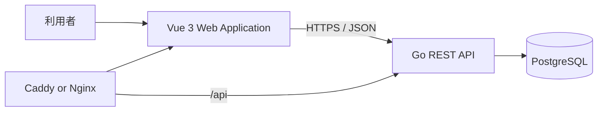
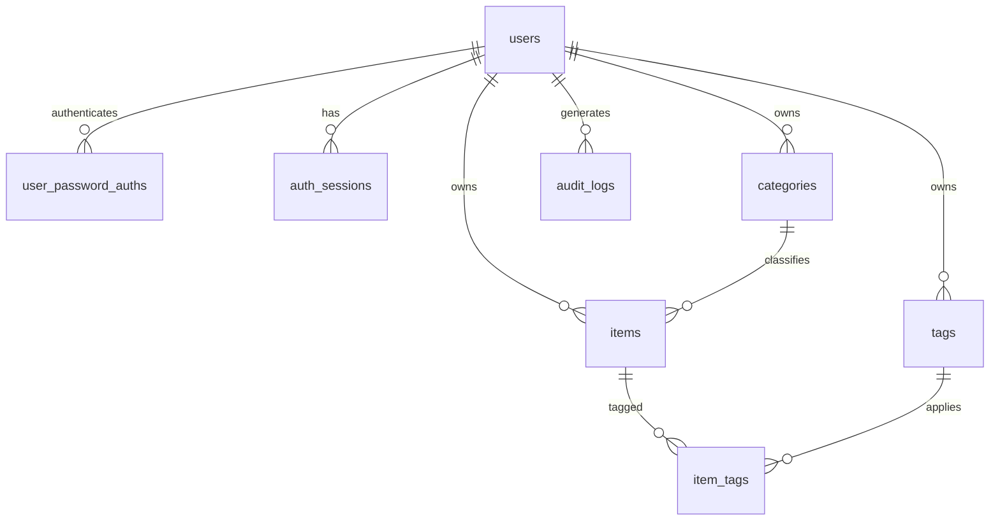

# LESS 詳細設計書

---

## 改訂方針

本設計書はアプリケーションのスコープを**所持品とタグの管理**へ縮小した改訂版である。

削除した対象:

| 削除対象 | 旧章 |
| --- | --- |
| 購入前審査 | 15章 |
| 収納・移動管理 (収納単位・収納割当・携行区分) | 16章 |
| シナリオ・持ち物リスト | 17章 |
| インポート・エクスポート | 21章 |
| 将来拡張 | 31章 |

**削除した章の番号は欠番とし、残る章を再採番しない。**
既存コードのコメントが `設計書 18.3` のように章番号で仕様を参照しているため、
番号を維持することで参照の追跡可能性を保つ。

旧14章「所有見直し判定ロジック」は、判定ロジックを削除して
14章「所有判断のcode体系」へ置き換えた。code体系そのものは所持品の属性として残す。

---

## 目次

1. [概要](#1-概要)
2. [設計の前提](#2-設計の前提)
3. [システム構成](#3-システム構成)
4. [技術構成](#4-技術構成)
5. [フォルダ構成](#5-フォルダ構成)
6. [命名規則](#6-命名規則)
7. [業務概念とドメインモデル](#7-業務概念とドメインモデル)
8. [機能一覧](#8-機能一覧)
9. [画面設計](#9-画面設計)
10. [フロントエンド設計](#10-フロントエンド設計)
11. [バックエンド設計](#11-バックエンド設計)
12. [REST-API設計](#12-rest-api設計)
13. [データベース設計](#13-データベース設計)
14. [所有判断のcode体系](#14-所有判断のcode体系)
18. [認証・認可](#18-認証認可)
19. [エラーハンドリング](#19-エラーハンドリング)
20. [トランザクション設計](#20-トランザクション設計)
22. [監査ログ](#22-監査ログ)
23. [非機能要件](#23-非機能要件)
24. [セキュリティ設計](#24-セキュリティ設計)
25. [テスト設計](#25-テスト設計)
26. [ローカル開発環境](#26-ローカル開発環境)
27. [CI・CD](#27-cicd)
28. [実装フェーズ](#28-実装フェーズ)
29. [AI駆動開発ルール](#29-ai駆動開発ルール)
30. [レビュー用チェックリスト](#30-レビュー用チェックリスト)

15章から17章、21章、31章は欠番である。

---

## 1. 概要

### 1.1 アプリケーション名

仮称を **LESS** とする。

### 1.2 目的

LESSは、所有物を単に一覧化するのではなく、以下を一つの判断体系で記録するWebアプリケーションである。

- 何を所有しているか
- どれだけ所有しているか
- どの分類に属するか
- どのくらいの必要度か
- どのくらいの頻度で使っているか

### 1.3 一般的な持ち物管理アプリとの差分

一般的な持ち物管理アプリは「何を持っているか」を中心に扱う。

LESSは、それに加えて所有判断の材料を構造化して持つ。

```text
必要度
使用頻度
種別 (耐久品・消耗品)
分類 (カテゴリー)
任意のラベル (タグ)
```

ダッシュボードはこれらの構成比を示し、
「どの分類に偏っているか」「不要と判断した物がどれだけ残っているか」を可視化する。

### 1.4 基本方針

| 項目 | 方針 | 目的 |
| --- | --- | --- |
| アーキテクチャ | レイヤードアーキテクチャを採用する | HTTP、業務ルール、DB実装を分離する |
| API | REST APIとして設計する | resourceとHTTP methodの関係を明確にする |
| API仕様 | OpenAPIを正本とする | フロントエンドとバックエンドの契約差異を防ぐ |
| DB | PostgreSQLを使用する | 制約、transaction、indexを活用する |
| 外部公開ID | 内部IDと分離する | DB内部構造をAPIへ公開しない |
| フロントエンド | Vue 3 + TypeScriptを使用する | モバイル優先の操作画面を構築する |
| バックエンド | Goを使用する | 単純で明示的なユースケース実装を行う |
| 状態管理 | global stateを必要最小限にする | データの二重管理を避ける |
| 集計 | server側で集計し、画面は表示のみを行う | 画面ごとの集計差異を防ぐ |
| 削除 | 原則soft deleteとする | 誤操作から復元可能にする |
| UI | 画面を簡潔に保つ | 判断と操作へ集中できるようにする |

---

## 2. 設計の前提

### 2.1 対象ユーザー

- 所有物を減らしたい個人
- 一人暮らしを始める個人
- 感覚ではなく明文化した基準で所有判断を行いたい個人

### 2.2 利用単位

- 1アカウントにつき1人分の所有物を管理する。
- 家族・同居人との共同管理は対象外とする。
- 1ユーザー最大10,000種類のアイテムを想定する。
- 表示言語は日本語を初期値とする。

### 2.3 主要な利用場面

1. 所有物を床へ並べて棚卸しする。
2. 所有物をカテゴリーへ分類し、タグを付ける。
3. 必要度と使用頻度を記録する。
4. ダッシュボードで所有量と構成比を確認する。
5. 不要と判断したアイテムをアーカイブする。

### 2.4 実装しないもの

- 収納単位・収納割当・携行区分の管理
- 所有見直しスコアの自動判定
- 購入前審査
- 旅行・引っ越し・避難用の持ち物リスト
- 使用記録の履歴管理
- CSV・JSONのインポート・エクスポート
- SNS、他ユーザーとの比較・ランキング
- AIによる自動廃棄決定
- 家計簿
- ネイティブアプリ
- 複数世帯管理

---

## 3. システム構成

### 3.1 全体構成



### 3.2 通信方針

- ブラウザからPostgreSQLへ直接接続しない。
- ブラウザからのデータ取得・更新はREST APIを経由する。
- 本番環境ではWebとAPIを同一オリジンで公開する。
- `/api/*` をGo APIへリバースプロキシする。
- APIのrequest・responseはJSONとする。ファイルアップロードは行わない。

### 3.3 依存方向

```text
presentation/http
    ↓
application
    ↓
domain

infrastructure
    ↓
domain
```

以下の依存を禁止する。

```text
domain -> HTTP
Domain -> PostgreSQL
Domain -> Vue
Domain -> OpenAPI generated type
Application -> net/http
Application -> pgx
Presentation -> SQL
```

---

## 4. 技術構成

### 4.1 フロントエンド

| 項目 | 採用技術 |
| --- | --- |
| 言語 | TypeScript |
| UI | Vue 3 Composition API |
| build | Vite |
| routing | Vue Router |
| API取得状態 | TanStack Query for Vue |
| global state | Pinia |
| validation | Zod |
| CSS | Tailwind CSS |
| グラフ | Chart.js + vue-chartjs |
| HTTP client | OpenAPIから生成したclient |
| unit test | Vitest |
| component test | Vue Testing Library |

form専用libraryは導入しない。入力状態は component の local state で保持し、
検証は Zod のschemaで行う。client validationはUX向上用とし、
server validationを正本とする (10.6)。

### 4.2 バックエンド

| 項目 | 採用技術 |
| --- | --- |
| 言語 | Go |
| HTTP router | chi |
| PostgreSQL driver | pgx |
| SQL code generation | sqlc |
| migration | goose |
| API specification | OpenAPI 3.0 |
| server code generation | oapi-codegen |
| logging | log/slog |
| password hash | Argon2id |
| unit test | testing package |
| integration test | testcontainers-go |
| static analysis | go vet、staticcheck |

### 4.3 データベース

- PostgreSQLを使用する。
- 内部主キーは `BIGINT GENERATED ALWAYS AS IDENTITY` とする。
- APIで使用する外部公開IDはUUIDとする。
- DB object名はlowercase `snake_case` とする。
- application側だけでなくDB制約でも不変条件を保証する。
- 時刻は `TIMESTAMP WITH TIME ZONE` でUTC保存する。

### 4.4 開発・配布

- Monorepo
- Docker Compose
- GitHub Actions
- CaddyまたはNginx
- Managed PostgreSQLを本番で使用可能な構成

---

## 5. フォルダ構成

### 5.1 全体構成

```text
less/
├── apps/
│   ├── web/
│   │   ├── src/
│   │   │   ├── api/
│   │   │   │   ├── generated/
│   │   │   │   └── queryKeys.ts
│   │   │   ├── assets/
│   │   │   ├── components/
│   │   │   │   ├── base/
│   │   │   │   ├── item/
│   │   │   │   └── dashboard/
│   │   │   ├── composables/
│   │   │   ├── layouts/
│   │   │   ├── pages/
│   │   │   ├── router/
│   │   │   ├── stores/
│   │   │   ├── types/
│   │   │   ├── utils/
│   │   │   ├── App.vue
│   │   │   └── main.ts
│   │   ├── tests/
│   │   ├── package.json
│   │   └── vite.config.ts
│   │
│   └── api/
│       ├── cmd/
│       │   ├── server/
│       │   │   └── main.go
│       │   └── migrate/
│       │       └── main.go
│       ├── internal/
│       │   ├── app/
│       │   ├── presentation/
│       │   │   └── http/
│       │   │       ├── auth/
│       │   │       ├── category/
│       │   │       ├── health/
│       │   │       ├── item/
│       │   │       ├── tag/
│       │   │       └── shared/
│       │   ├── application/
│       │   │   ├── audit/
│       │   │   ├── auth/
│       │   │   ├── category/
│       │   │   ├── item/
│       │   │   └── tag/
│       │   ├── domain/
│       │   │   ├── audit/
│       │   │   ├── auth/
│       │   │   ├── category/
│       │   │   ├── item/
│       │   │   ├── tag/
│       │   │   └── shared/
│       │   ├── infrastructure/
│       │   │   ├── config/
│       │   │   ├── crypto/
│       │   │   ├── postgresql/
│       │   │   └── repositories/
│       │   │       └── postgresql/
│       │   ├── generated/
│       │   │   ├── openapi/
│       │   │   └── sqlc/
│       │   └── platform/
│       │       ├── clock/
│       │       ├── idgenerator/
│       │       ├── logging/
│       │       └── transaction/
│       ├── sql/
│       │   └── queries/
│       ├── go.mod
│       └── go.sum
│
├── db/
│   ├── migrations/
│   ├── seeds/
│   └── schema.sql
├── docs/
│   ├── api/
│   │   └── openapi.yml
│   └── design/
│       └── detailed-design.md
├── deployments/
│   ├── docker/
│   └── caddy/
├── compose.yml
├── Makefile
├── package.json
├── pnpm-workspace.yaml
├── AGENTS.md
├── CLAUDE.md
└── README.md
```

### 5.2 フロントエンドの責務

| path | 責務 |
| --- | --- |
| `components/base/` | featureへ依存しない基礎UI |
| `components/<feature>/` | feature固有UI |
| `composables/` | 複数画面で再利用する状態・API処理 |
| `layouts/` | 認証後の共通レイアウト |
| `pages/` | URL単位の画面 |
| `router/` | route定義、guard |
| `stores/` | 認証等の最小限のglobal state |
| `api/generated/` | OpenAPI生成client。手動編集禁止 |
| `utils/` | 副作用を持たない汎用関数 |

### 5.3 バックエンドの責務

| layer | 主な責務 | 書かないもの |
| --- | --- | --- |
| presentation | HTTP入力、DTO変換、認証呼出、HTTP error変換 | SQL、業務状態遷移 |
| application | ユースケース、transaction境界、Repository呼出 | HTTP status、SQL |
| domain | Entity、ValueObject、業務ルール、Repository interface | HTTP、PostgreSQL |
| infrastructure | PostgreSQL Repository、config、技術実装 | UI、HTTP response組立 |

---

## 6. 命名規則

### 6.1 基本原則

- 一般的でない略語を使用しない。
- 名前から責務を推測できるようにする。
- `data`、`info`、`manager`、`helper` 等の曖昧な名前を避ける。

### 6.2 Casing

| 対象 | casing | 例 |
| --- | --- | --- |
| TypeScript component | PascalCase | `ItemDetailCard.vue` |
| TypeScript type | PascalCase | `ItemListResponse` |
| TypeScript variable | camelCase | `itemPublicId` |
| TypeScript constant | SCREAMING_SNAKE_CASE | `MAX_PAGE_SIZE` |
| Vue page | kebab-case | `item-detail.vue` |
| Vue composable | `use` + camelCase | `useItemList.ts` |
| Go exported type | PascalCase | `CreateItemService` |
| Go unexported variable | camelCase | `itemRepository` |
| Go package | lowercase | `item` |
| Go file | snake_case | `create_item_service.go` |
| REST API path | kebab-case | `/dashboard/summary` |
| JSON field | camelCase | `usageFrequencyCode` |
| enum value | lowercase snake_case | `essential` |
| PostgreSQL schema | snake_case | `ownership` |
| PostgreSQL table | plural snake_case | `item_tags` |
| PostgreSQL column | snake_case | `public_id` |
| environment variable | SCREAMING_SNAKE_CASE | `DATABASE_URL` |

### 6.3 Vue component

- 基礎UIは `Base` prefixを付ける。
- アプリ全体構造は `App` prefixを付ける。
- feature固有componentは業務名を先頭へ置く。

```text
BaseButton.vue
BaseInput.vue
AppShell.vue
ItemList.vue
ItemListFilters.vue
BreakdownDonutChart.vue
```

### 6.4 Go Application Service

ユースケースをverbから始め、`Service` suffixを付ける。

```text
CreateItemService
UpdateItemService
ArchiveItemService
GetDashboardSummaryService
```

公開methodは `Execute()` に統一する。

### 6.5 Repository

Domain interface:

```text
ItemRepository
CategoryRepository
TagRepository
```

PostgreSQL実装:

```text
PostgresqlItemRepository
PostgresqlTagRepository
```

### 6.6 REST API

- resource名は複数形のkebab-caseとする。
- path parameter、query parameter、JSON fieldはcamelCaseとする。
- 内部IDではなく `publicId` を使用する。
- CRUDで表現できない操作だけaction pathを使用する。

```text
GET  /api/items/{publicId}
POST /api/items/{publicId}/archive
GET  /api/dashboard/summary
```

---

## 7. 業務概念とドメインモデル

### 7.1 Aggregate一覧

| Aggregate | 役割 |
| --- | --- |
| User | 利用者と認証状態 |
| Item | 所有物と所有判断情報 |
| Category | アイテムの主分類 |
| Tag | アイテムへ付与する任意のlabel |

### 7.2 Item

Itemは同一名称・用途としてまとめて管理する所有物を表す。

主な状態:

```text
name
category
kind
quantity
unitName
necessityLevel
usageFrequency
purchasedOn
sourceUrl
notes
tags
```

不変条件:

- 数量は0以上、上限は1,000,000。
- カテゴリーは必須で、同一ユーザーのカテゴリーだけを指定できる。
- タグは同一ユーザーのタグだけを指定でき、1アイテムあたり30件以内とする。
- 単位が未指定の場合は「個」を適用する。
- 種別が未指定の場合は `durable` を適用する。
- 商品URLは `http` または `https` で始まる形式に限る。
- archive済みのItemは編集できない。

archiveはsoft deleteとして表現する。数量を0にしてもarchiveへ自動遷移させない。
所有をやめる判断は利用者が明示的にarchiveとして行う。

### 7.3 Category

アイテムの主分類を表す。

- ユーザー登録時に既定カテゴリーを作成する (28章 Phase 1)。
- 有効なカテゴリー名はユーザー内で一意とする。
- 表示順は `sortOrder` の昇順とする。
- 本スコープではカテゴリーの追加・変更・削除画面を持たず、参照のみを提供する。

### 7.4 Tag

アイテムへ付与する任意のlabelを表す。

- 有効なタグ名はユーザー内で一意とする。
- 削除は付与関係ごと物理削除する。削除済みの名称は再利用できる。
- タグ一覧は付与済みアイテム件数を併せて返す。

---

## 8. 機能一覧

| ID | 機能 |
| --- | --- |
| F-001 | ユーザー登録・ログイン・ログアウト |
| F-002 | ダッシュボード (所有量と構成比の集計) |
| F-003 | アイテム登録・編集・検索・アーカイブ |
| F-004 | カテゴリー参照 |
| F-005 | タグ管理 |
| F-006 | マイページ (アカウント情報の表示) |
| F-007 | 監査履歴の記録 |

F-007は記録のみを行い、参照画面は持たない (22章)。

---

## 9. 画面設計

### 9.1 route一覧

| path | 画面 | 認証 |
| --- | --- | --- |
| `/` | `/dashboard` へリダイレクト | 不要 |
| `/login` | ログイン | 未ログインのみ |
| `/register` | ユーザー登録 | 未ログインのみ |
| `/dashboard` | ダッシュボード | 必須 |
| `/items` | アイテム一覧 | 必須 |
| `/items/new` | アイテム登録 | 必須 |
| `/items/:publicId` | アイテム詳細 | 必須 |
| `/items/:publicId/edit` | アイテム編集 | 必須 |
| `/tags` | タグ管理 | 必須 |
| `/mypage` | マイページ | 必須 |

未定義のpathは `/dashboard` へリダイレクトする。

### 9.2 共通レイアウト

画面数が少ないため、headerと主要navigationのみとする。
sidebar・bottom navigationは持たない。

```text
┌────────────────────────────────────────────┐
│ LESS            表示名   [ログアウト]      │
│ ホーム 所持品 タグ マイページ              │
├────────────────────────────────────────────┤
│ Main Content                               │
└────────────────────────────────────────────┘
```

navigation:

| label | route |
| --- | --- |
| ホーム | `/dashboard` |
| 所持品 | `/items` |
| タグ | `/tags` |
| マイページ | `/mypage` |

アイテム詳細・編集のような下位画面では、対応する上位navigation (所持品) を選択中として示す。

ログアウトは作業中の離脱を避けるため確認を挟む (10.6)。

### 9.3 ダッシュボード

`/dashboard` はホームであり、所有量の合計と構成比だけを表示する。
アカウント情報は本画面ではなくマイページ (9.6) へ置く。

集計値:

| 表示 | 単位 | 定義 |
| --- | --- | --- |
| 所持アイテム種類数 | アイテム種別 | 登録済みアイテムの件数 |
| 所持アイテム数 | アイテム数 | 各アイテムの数量の合計 |

内訳の円グラフ:

1. カテゴリー別
2. 必要度別
3. 使用頻度別

集計の方針:

- archive済みのアイテムは集計へ含めない。
- 集計はserverが行い、画面はresponseを表示するだけとする (12.4)。
- 円グラフの構成比はアイテムの**種類数**で示す。数量はtooltipと凡例へ併記する。
- 内訳は該当アイテムが1件以上ある区分のみを返す。件数0の区分は表示しない。
- 必要度・使用頻度の並びはcode体系の定義順とする (14章)。
- カテゴリーの並びはカテゴリーの表示順とする。

円グラフの表示制約:

- 色は区分の識別のためだけに使う。色だけで意味を伝えない (10.9)。
- 凡例は区分名・種類数・数量・割合を文字で示し、数値表を兼ねる。
- 区分数が色数の上限 (8) を超える場合は「他 N区分」へ畳み、色数を抑える。

アイテムが1件も無い場合はempty状態を表示し、アイテム登録へ導線を出す。

### 9.4 アイテム一覧

デスクトップ列:

```text
アイテム名 (タグ・アーカイブ状態を併記)
カテゴリー
数量
使用頻度
必要度
種別
更新日時
```

モバイルはカード表示へ切り替える (10.8)。

filter:

- keyword (アイテム名・メモの部分一致)
- categoryPublicId
- tagPublicId
- necessityLevelCode
- usageFrequencyCode
- includeDeleted (アーカイブ済みを含める)

sort:

- updatedAt (既定)
- name
- quantity

order:

- desc (既定)
- asc

検索条件はURL query parameterを唯一の保持先とする (10.4)。
これにより画面のreloadや共有でも同じ条件を再現できる。

一括操作は持たない。

### 9.5 アイテム詳細

section:

1. 基本情報 (種別・必要度・使用頻度・購入日・商品URL・更新日時・メモ・タグ)
2. 危険な操作

主要操作:

- 編集

危険操作:

- アーカイブ
- 復元 (アーカイブ済みの場合)

危険操作は画面下部へ配置し、アーカイブには確認を挟む (10.6)。

### 9.6 マイページ

ログイン中のアカウント情報を表示する。

```text
表示名
メールアドレス
タイムゾーン
表示言語
```

表示名・メールアドレス・パスワードの変更操作は本スコープに含めない。
アカウント情報を取得できない場合はerrorを表示し、再ログインを促す。

---

## 10. フロントエンド設計

### 10.1 page

pageへ書くもの:

- page全体構造
- page固有データ取得
- page固有state
- composable呼出
- componentへのprops
- emit受信
- page metadata

pageへ書かないもの:

- 巨大なmarkup
- API clientの直接実装
- 複数pageで重複する処理
- backendの業務ルール

### 10.2 component

- 一つの明確なUI責務を持つ。
- propsを直接変更しない。
- 操作はemitで親へ通知する。
- feature固有API通信をBase componentへ書かない。
- 行数だけを理由に無意味なcomponentへ分割しない。

### 10.3 composable

適切な用途:

- API通信
- pagination
- filter
- form送信
- auth session
- browser API

例:

```text
useAuthSession.ts
useItemList.ts
useItemDetail.ts
useItemFormOptions.ts
useTagManagement.ts
useDashboardSummary.ts
```

### 10.4 状態管理

| state | 管理方法 |
| --- | --- |
| API由来データ | TanStack Query |
| 認証状態 | Pinia |
| sidebar開閉等 | Piniaまたはlocal state |
| form値 | component内のlocal state |
| filter | URL query parameter |

禁止:

- API responseをPiniaへ複製する。
- pageごとに同一resourceを別形式で保持する。
- localStorageへ認証tokenを保存する。

### 10.5 API client

- `docs/api/openapi.yml` からTypeScript clientを生成する。
- `src/api/generated/` は手動編集しない。
- API変更時はOpenAPI、Go server、TypeScript clientを同時更新する。

### 10.6 form

- 送信中は二重送信を防止する。
- client validationはUX向上用とする。
- server validationを必須とする。
- 400・422のfield errorを該当入力欄へ表示する。
- 未保存離脱時は確認する。

### 10.7 UI状態

各一覧・詳細画面で以下を明示する。

```text
loading
error
empty
success
```

空状態には次の操作を表示する。

```text
アイテムがありません。
[最初のアイテムを追加]
```

### 10.8 responsive design

- mobile-firstとする。
- 表形式はモバイルでカード表示へ切り替える。
- checklist操作のtap領域は44px以上とする。
- 主要操作は片手で実行できる位置へ置く。

### 10.9 accessibility

- labelとinputを関連付ける。
- keyboardで操作可能にする。
- focus表示を消さない。
- 色だけで状態を表さない。
- modalはfocus trapを実装する。
- error messageをscreen readerへ通知する。

---

## 11. バックエンド設計

### 11.1 標準処理フロー

```text
HTTP Request
  ↓
Handler
  ↓
Request DTO / OpenAPI generated request
  ↓
Application Params
  ↓
Application Service.Execute()
  ↓
Domain Entity / ValueObject / Repository
  ↓
Application Result
  ↓
Response DTO
  ↓
HTTP Response
```

### 11.2 Handlerへ書くもの

- path、query、body取得
- request validationの呼出
- 認証済みUser取得
- Application Service呼出
- Response DTO変換
- HTTP error変換
- Cookie操作

### 11.3 Handlerへ書かないもの

- SQL
- DB rowからresponse JSONを直接作る処理
- 複雑な業務ロジック
- Entityの状態遷移
- PostgreSQL固有型

### 11.4 Application Service

ユースケース単位で作成する。

例:

```text
CreateItemService
UpdateItemService
GetItemService
ListItemsService
ArchiveItemService
RestoreItemService
GetDashboardSummaryService
CreateTagService
```

Application Serviceの責務:

- Repository呼出
- Entity生成
- ValueObject生成
- transaction制御
- 複数処理の順序制御
- Domain errorの伝播
- audit log記録

### 11.5 Domain

Domainに置くもの:

- Entity
- ValueObject
- Repository interface
- 状態遷移 (archive / restore)
- code体系とlabelの対応
- 数量制約
- 集計値の表示順
- Domain error

### 11.6 Repository

- DB rowとDomain Entityを分離する。
- Repository interfaceをDomainに置く。
- PostgreSQL実装をInfrastructureに置く。
- SQLは `sql/queries/` に置き、sqlcで生成する。
- すべてのユーザーデータqueryでUser internal IDを条件に含める。

### 11.7 楽観ロック

更新対象tableは `version` を持つ。

```sql
UPDATE ownership.items
SET
  name = $1,
  version = version + 1,
  updated_at = NOW()
WHERE id = $2
  AND user_id = $3
  AND version = $4;
```

更新件数が0の場合、競合または対象不存在として扱う。

---

## 12. REST API設計

OpenAPI (`docs/api/openapi.yml`) を契約の正本とする。
本章はその方針を述べるものであり、値の詳細はOpenAPIを参照する。

### 12.1 共通仕様

- base path: `/api`
- Content-Type: `application/json`
- datetime: RFC3339 (UTC)
- JSON field: camelCase
- enum value: lowercase snake_case
- path: plural kebab-case
- URLではpublicIdを使用する。内部IDをAPIへ公開しない。
- single resourceはresource objectを直接返す。
- listはitemsとpaginationを返す。

### 12.2 pagination

アイテム一覧は任意のsort keyとの組み合わせ、および総件数表示を要件とするため、
cursor paginationではなく `limit` / `offset` によるoffset paginationとする。

request:

```text
limit   未指定時は50、上限は100
offset  未指定時は0
```

response:

```json
{
  "items": [],
  "pagination": {
    "limit": 50,
    "offset": 0,
    "totalCount": 128,
    "hasNext": true
  }
}
```

### 12.3 共通error

```json
{
  "code": "ITEM_VERSION_CONFLICT",
  "message": "アイテムが別の操作で更新されています。",
  "fieldErrors": [],
  "requestId": "req_xxx"
}
```

- `code` は機械判定用のSCREAMING_SNAKE_CASEとする。
- `message` は利用者向けとし、内部stack traceを含めない。
- `fieldErrors[].field` はrequest bodyのfield名 (camelCase) と一致させ、
  画面が該当入力欄へerrorを表示できるようにする。
- `requestId` はserver logと突き合わせるために返す。

### 12.4 endpoint一覧

#### Auth

| method | path | operationId |
| --- | --- | --- |
| POST | `/api/auth/register` | `registerUser` |
| POST | `/api/auth/login` | `loginUser` |
| POST | `/api/auth/logout` | `logoutUser` |
| GET | `/api/auth/context` | `getAuthenticatedUserContext` |

#### Dashboard

| method | path | operationId |
| --- | --- | --- |
| GET | `/api/dashboard/summary` | `getDashboardSummary` |

#### Items

| method | path | operationId |
| --- | --- | --- |
| GET | `/api/items` | `listItems` |
| POST | `/api/items` | `createItem` |
| GET | `/api/items/{publicId}` | `getItemByPublicId` |
| PUT | `/api/items/{publicId}` | `updateItem` |
| POST | `/api/items/{publicId}/archive` | `archiveItem` |
| POST | `/api/items/{publicId}/restore` | `restoreItem` |

更新は全項目を置き換える。省略した任意項目はNULLへ更新される。
PATCHによる部分更新は導入しない。

#### Categories / Tags

| method | path | operationId |
| --- | --- | --- |
| GET | `/api/categories` | `listCategories` |
| GET | `/api/tags` | `listTags` |
| POST | `/api/tags` | `createTag` |
| PUT | `/api/tags/{publicId}` | `updateTag` |
| DELETE | `/api/tags/{publicId}` | `deleteTag` |

`/health/live` と `/health/ready` は監視用endpointであり、`/api` prefixを持たない。

### 12.5 CreateItemRequest

```json
{
  "name": "折りたたみ傘",
  "categoryPublicId": "uuid",
  "itemKindCode": "durable",
  "quantity": 1,
  "unitName": "本",
  "necessityLevelCode": "essential",
  "usageFrequencyCode": "monthly",
  "purchasedOn": null,
  "sourceUrl": null,
  "notes": null,
  "tagPublicIds": []
}
```

`UpdateItemRequest` は同じ項目へ `expectedVersion` を加えたものとする。

### 12.6 ItemResponse

codeとlabelを対で返す。画面はresponseのlabelをそのまま表示し、
code体系の対応表をフロントエンドへ二重に持たない。

```json
{
  "publicId": "uuid",
  "name": "折りたたみ傘",
  "category": {
    "publicId": "uuid",
    "name": "外出・携行品"
  },
  "itemKindCode": "durable",
  "itemKindLabel": "耐久品",
  "quantity": 1,
  "unitName": "本",
  "necessityLevelCode": "essential",
  "necessityLevelLabel": "必須",
  "usageFrequencyCode": "monthly",
  "usageFrequencyLabel": "月に1回程度",
  "purchasedOn": null,
  "sourceUrl": null,
  "notes": null,
  "tags": [],
  "isArchived": false,
  "archivedAt": null,
  "version": 3,
  "createdAt": "2026-07-25T00:00:00Z",
  "updatedAt": "2026-07-25T00:00:00Z"
}
```

`DashboardSummaryResponse` も同じ方針で、内訳の各要素が `code` と `label` を持つ。

---

## 13. データベース設計

### 13.1 schema

| schema | 用途 |
| --- | --- |
| `identity` | ユーザー、認証情報、認証session |
| `ownership` | 所有物、分類、タグ |
| `audit` | 操作履歴 |

### 13.2 ER図



### 13.3 共通column

業務tableは原則として以下を持つ。

```text
id
public_id
created_at
updated_at
version
```

soft delete対象は `deleted_at` を持つ。
追記のみのtable (`item_tags`、`audit_logs`) は `updated_at` / `version` を持たない。

### 13.4 constraint命名

```text
pk_<table>
fk_<table>__<column>
uq_<table>__<columns>
ck_<table>__<rule>
idx_<table>__<columns>
```

### 13.5 table一覧

#### identity

```text
users
user_password_auths
auth_sessions
```

#### ownership

```text
categories
tags
items
item_tags
```

#### audit

```text
audit_logs
```

### 13.6 users

| column | type | null | 説明 |
| --- | --- | --- | --- |
| id | BIGINT | no | 内部主キー |
| public_id | UUID | no | 外部公開ID |
| email | TEXT | no | lowercaseで保持 |
| display_name | TEXT | no | 表示名 |
| timezone | TEXT | no | 初期値Asia/Tokyo |
| locale | TEXT | no | 初期値ja-JP |
| created_at | TIMESTAMPTZ | no | 作成日時 |
| updated_at | TIMESTAMPTZ | no | 更新日時 |
| deleted_at | TIMESTAMPTZ | yes | soft delete |
| version | INTEGER | no | 楽観ロック |

password hashはusersへ保持せず、`user_password_auths` へ分離する。

### 13.7 items

| column | type | null | 説明 |
| --- | --- | --- | --- |
| id | BIGINT | no | 内部主キー |
| public_id | UUID | no | 外部公開ID |
| user_id | BIGINT | no | 所有者 |
| category_id | BIGINT | no | カテゴリー |
| name | TEXT | no | アイテム名 |
| item_kind_code | TEXT | no | 種別 |
| quantity | INTEGER | no | 所有数量 |
| unit_name | TEXT | no | 個、枚、足等 |
| necessity_level_code | TEXT | no | 必要度 |
| usage_frequency_code | TEXT | no | 使用頻度 |
| purchased_on | DATE | yes | 購入日 |
| source_url | TEXT | yes | 商品URL |
| notes | TEXT | yes | メモ |
| created_at | TIMESTAMPTZ | no | 作成日時 |
| updated_at | TIMESTAMPTZ | no | 更新日時 |
| deleted_at | TIMESTAMPTZ | yes | archive日時 (soft delete) |
| version | INTEGER | no | 楽観ロック |

主要constraint:

```text
quantity >= 0
name は1〜200文字
unit_name は1〜20文字
notes は2000文字以内
source_url は ^https?:// にマッチする
item_kind_code / necessity_level_code / usage_frequency_code は14章の値集合に含まれる
(user_id, category_id) は categories (user_id, id) を参照する
```

最後のcomposite foreign keyにより、
他ユーザーのカテゴリーを参照できないことをDB側でも保証する (18.3)。

### 13.14 index

実際のqueryに基づいて以下を持つ。

```text
uq_users__public_id
uq_items__public_id
idx_items__user_id_deleted_at
idx_items__user_id_category_id_deleted_at
idx_items__user_id_updated_at
idx_item_tags__tag_id_item_id
idx_categories__user_id_sort_order
idx_audit_logs__user_id_created_at
```

無差別にindexを追加しない。複合indexのcolumn順はqueryを確認して決める。

ダッシュボードの集計は `idx_items__user_id_deleted_at` と
`idx_items__user_id_category_id_deleted_at` を利用する。
必要度別・使用頻度別の集計は全件走査となるが、
1ユーザーあたり最大10,000件 (2.2) を前提として専用indexを持たない。

---

## 14. 所有判断のcode体系

codeとlabelの対応はDomainのValueObjectが保持し、APIはcodeとlabelを対で返す (12.6)。
画面はresponseのlabelを表示し、選択肢の初期表示にのみフロントエンドの定義を使う。

内訳の表示順はDomainが決める。DBの集計結果の並びに依存させない (9.3)。

### 14.1 使用頻度

| code | label | 表示順 |
| --- | --- | ---: |
| daily | 毎日 | 1 |
| weekly | 週に1回程度 | 2 |
| monthly | 月に1回程度 | 3 |
| quarterly | 3か月に1回程度 | 4 |
| yearly | 年に1回程度 | 5 |
| rarely | ほとんど使っていない | 6 |
| never | 使っていない | 7 |

使用頻度の高い順に並べる。

### 14.2 必要度

| code | label | 表示順 |
| --- | --- | ---: |
| essential | 必須 | 1 |
| important | 重要 | 2 |
| optional | 任意 | 3 |
| undecided | 未判断 | 4 |
| unnecessary | 不要 | 5 |

必要性の高い順に並べる。`undecided` は判断を保留した状態を表し、
`unnecessary` と区別する。判断していないことを「不要」として扱わない。

### 14.3 アイテム種別

| code | label |
| --- | --- |
| durable | 耐久品 |
| consumable | 消耗品 |

未指定時は `durable` を適用する。

---

## 18. 認証・認可

### 18.1 認証方式

- email + password
- passwordはArgon2idでhash化する。
- session tokenは暗号学的に安全なrandom値を使用する。
- DBにはtoken hashだけ保存する。
- tokenはhttpOnly Cookieへ保存する。

### 18.2 Cookie

| attribute | value |
| --- | --- |
| HttpOnly | true |
| Secure | 本番true |
| SameSite | Lax |
| Path | `/` |
| MaxAge | 30日 |

### 18.3 認可

すべてのユーザーデータqueryで認証Userのinternal IDを条件に含める。

```sql
WHERE public_id = $1
  AND user_id = $2
  AND deleted_at IS NULL
```

他ユーザーのpublicIdを指定した場合も404を返し、存在有無を公開しない。

### 18.4 CSRF

- state変更APIへCSRF tokenを要求する。
- CookieのSameSiteだけに依存しない。
- Web起動時にCSRF tokenを取得し、custom headerで送信する。

---

## 19. エラーハンドリング

### 19.1 Domain error例

```text
ItemNotFoundError
ItemVersionConflictError
ItemArchivedError
CategoryNotFoundError
TagNotFoundError
TagNameAlreadyUsedError
```

### 19.2 HTTP status

| status | 用途 |
| ---: | --- |
| 200 | 取得、更新、action成功 |
| 201 | resource作成 |
| 204 | bodyなし削除成功 |
| 400 | request形式不正 |
| 401 | 未認証 |
| 403 | 認証済みだが操作不可 |
| 404 | 対象不存在 |
| 409 | version競合、unique競合、状態競合 |
| 422 | 業務ルール違反 |
| 429 | rate limit |
| 500 | 予期しないerror |

### 19.3 ログ

error responseへ内部stack traceを含めない。

server logには以下を含める。

```text
requestId
userPublicId
method
path
status
durationMs
errorCode
```

以下を含めない。

```text
password
session token
Cookie
CSRF secret
パスポート番号等の機微情報
```

---

## 20. トランザクション設計

業務操作と監査ログは必ず単一transactionで実行する。
監査ログの記録に失敗した場合は業務操作もrollbackする。

### 20.1 アイテム登録・更新

```text
BEGIN
  categories SELECT   カテゴリー解決 (他ユーザーのカテゴリーは404)
  tags SELECT         タグ解決 (他ユーザーのタグは404)
  items INSERT / UPDATE
  item_tags DELETE + INSERT   タグ付与の全置換
  audit_logs INSERT
COMMIT
```

更新は `version` をWHERE条件へ含め、更新件数0を競合として扱う (11.7)。
更新件数0の理由が「不存在」か「競合」かは、
同一transaction内で存在確認を行って判定する。

差分が無い更新では監査ログを残さない。
操作としては成立しているが、差分の無い履歴に情報が無いためである (22章)。

### 20.2 アイテムのarchive・restore

```text
BEGIN
  items UPDATE   deleted_at の設定または解除、version + 1
  audit_logs INSERT
COMMIT
```

### 20.3 タグの登録・更新・削除

```text
BEGIN
  tags INSERT / UPDATE / DELETE
  item_tags は foreign key の ON DELETE CASCADE で削除される
  audit_logs INSERT
COMMIT
```

タグ名の一意制約違反は409として返す (19.2)。

### 20.4 ダッシュボード集計

参照のみのためtransactionを張らない。

合計と3種の内訳をそれぞれのGROUP BY queryで取得する。
単一queryへまとめるとカテゴリーとcodeの直積で行数が膨らむため分割する。

---

## 22. 監査ログ

記録対象:

- login成功・失敗
- logout
- ユーザー登録
- Item作成・更新・archive・restore
- Tag作成・更新・削除

Audit payloadは差分だけを保存し、機微情報を保存しない。
password、session token、CSRF tokenは記録対象へ含めない。

差分が無い更新は記録しない。

操作履歴の参照画面はスコープへ含めない。記録は障害調査と不正操作の検知に使う。

---

## 23. 非機能要件

### 23.1 性能

| 対象 | 目標 |
| --- | --- |
| 一覧API p95 | 500ms未満 |
| 詳細API p95 | 300ms未満 |
| 更新API p95 | 500ms未満 |
| 初期画面表示 | 3秒未満 |
| 集計API p95 | 500ms未満 |
| 1User Item種類数 | 10,000まで |

### 23.2 可用性

- 月間99.5%以上を目安とする。
- `/health/live` と `/health/ready` を提供する。
- DB接続不能時はreadinessを失敗させる。

### 23.3 backup

- PostgreSQL日次backup
- 日次7世代
- 週次4世代
- 復元手順を文書化

### 23.4 locale

- 初期版は日本語。
- UI文字列はi18n辞書へ分離する。
- 時刻はUser timezoneで表示する。

---

## 24. セキュリティ設計

1. TLS必須
2. httpOnly Cookie
3. Secure Cookie
4. SameSite Cookie
5. CSRF対策
6. CORS許可元固定
7. Argon2id
8. login rate limit
9. SQL parameter化
10. XSS対策
11. Content Security Policy
12. X-Content-Type-Options
13. Referrer-Policy
14. request body size制限
15. URL schemeをhttp/httpsへ限定
16. secretをGit管理しない
17. dependency vulnerability scan
18. session失効機能

---

## 25. テスト設計

### 25.1 unit test

Domainを中心に正常系、異常系、境界値を確認する。

必須対象:

- ValueObject (Email、Password、code体系)
- Item属性の検証と正規化
- Item数量の境界値 (0、上限)
- Itemのarchive / restoreの状態遷移
- 楽観ロックのversion不一致
- 集計値の表示順 (`NewSummary`)
- Application Serviceのユースケース (fake repositoryを使用)

### 25.2 integration test

testcontainers-goまたはcompose上のPostgreSQLを起動する。

- Repository CRUD
- unique・check・foreign key
- soft delete
- optimistic lock
- transaction rollback
- 他User data不可視
- ダッシュボード集計 (archive済み・他ユーザー分の除外)
- router全体を通したHTTP API (認証・CSRF・status code)

### 25.3 frontend test

- form validation
- loading、error、empty、successの4状態
- filter URL同期
- 破壊的操作の確認dialog
- 円グラフの内訳が区分名と件数を文字で示すこと

Chart.jsはcanvasを必要とし、jsdomでは描画できない。
円グラフのcanvas描画そのものはtest対象外とし、componentを差し替えて検証する。

### 25.4 E2E

E2E testは本スコープに含めない。
router全体を通したintegration test (25.2) とcomponent test (25.3) で代替する。

### 25.5 TDD flow

```text
1. 仕様確認
2. OpenAPI、DB定義、関連コード確認
3. 失敗するtest作成
4. 最小実装
5. 責務整理
6. lint、typecheck、test
```

不具合修正では再現testを先に追加する。

---

## 26. ローカル開発環境

### 26.1 compose service

```text
postgres
api
web
reverse-proxy
```

### 26.2 command

```text
make setup
make dev
make format
make lint
make typecheck
make test
make test-integration
make e2e
make generate-openapi
make generate-sqlc
make migrate-up
make migrate-down
make seed
make db-reset
```

### 26.3 environment variable

```text
APP_ENV
WEB_BASE_URL
API_BASE_URL
DATABASE_URL
SESSION_COOKIE_NAME
SESSION_TTL_HOURS
PASSWORD_PEPPER
CSRF_SECRET
CORS_ALLOWED_ORIGINS
LOG_LEVEL
MAX_IMPORT_SIZE_MB
EXPORT_TTL_MINUTES
```

`.env.example` を用意する。秘密値をGitへcommitしない。

---

## 27. CI・CD

### 27.1 Pull Request

Frontend:

1. format check
2. ESLint
3. TypeScript typecheck
4. unit/component test
5. build

Backend:

1. gofmt check
2. go vet
3. staticcheck
4. unit test
5. integration test
6. build

Contract / DB:

1. OpenAPI validation
2. generated code差分確認
3. migration適用確認
4. schema dump差分確認
5. sqlc generated code差分確認

System:

1. Docker image build
2. E2E smoke test
3. dependency scan

### 27.2 main merge

1. image build
2. registry push
3. DB backup
4. migration実行
5. API deploy
6. Web deploy
7. health check
8. 失敗時rollback

適用済みmigrationは原則書き換えない。forward-onlyで追加する。

---

## 28. 実装フェーズ

### Phase 0: 基盤

- Monorepo
- Vue、Go、PostgreSQL
- Docker Compose
- OpenAPI
- sqlc
- migration
- 共通error
- request ID
- logging
- auth
- CI

完了条件:

- register、login、logoutが動作する。
- local環境が1commandで起動する。
- CIが成功する。

### Phase 1: Item・Category・Tag

- Category初期data (ユーザー登録時に既定カテゴリーを作成する)
- Item CRUD
- list / filter / sort
- Tag CRUD
- optimistic lock

### Phase 2: ダッシュボード・マイページ

- 集計API (`GET /api/dashboard/summary`)
- 所有量の合計表示
- カテゴリー別・必要度別・使用頻度別の円グラフ
- マイページ (アカウント情報の表示)

### Phase 3: 公開品質

- accessibility
- security header
- backup
- production deployment
- privacy policy

Phase 2まで完了済みである。

過去の設計では収納・移動管理をPhase 2、所有見直し判定をPhase 3、
購入前審査をPhase 4、シナリオをPhase 5、インポート・エクスポートをPhase 6として
計画していたが、スコープ縮小により削除した。

---

## 29. AI駆動開発ルール

AI agentがリポジトリを変更する際の制約は `AGENTS.md` および `CLAUDE.md` を正本とする。

要点:

- 実装前に関連docsを読む。
- API変更はOpenAPIを先に変更する。
- DB変更は新規migrationを作る。適用済みmigrationを書き換えない。
- generated codeを手動編集しない。
- SQLと業務ルールをHandlerへ書かない。
- DomainからHTTP・PostgreSQLへ依存させない。
- User data queryへuser ID条件を必ず含める。
- 仕様不足を推測で埋めず、判断事項として報告する。
- 変更後に `make verify` を実行する。

---

## 30. レビュー用チェックリスト

### 30.1 Architecture

- [ ] presentation、application、domain、infrastructureの責務が分離されている。
- [ ] DomainがHTTP・PostgreSQLへ依存していない。
- [ ] Application Serviceがユースケース単位になっている。
- [ ] SQLがRepositoryへ閉じ込められている。

### 30.2 REST API

- [ ] resource pathが複数形kebab-caseである。
- [ ] JSON fieldがcamelCaseである。
- [ ] enumがlowercase snake_caseである。
- [ ] publicIdを使用している。
- [ ] OpenAPIが更新されている。
- [ ] error schemaが共通化されている。
- [ ] 認証・認可をAPI側で確認している。

### 30.3 Database

- [ ] table・columnがsnake_caseである。
- [ ] constraint名が規則に従っている。
- [ ] NOT NULL、CHECK、FKが適切である。
- [ ] NULLの意味が明確である。
- [ ] internal IDとpublic IDが分離されている。
- [ ] soft delete queryが正しい。
- [ ] indexが実queryに基づいている。
- [ ] migrationがforward-onlyで追加されている。

### 30.4 Frontend

- [ ] pageが肥大化していない。
- [ ] Base componentにfeature logicがない。
- [ ] loading、error、empty、successがある。
- [ ] formの二重送信を防止している。
- [ ] keyboard操作が可能である。
- [ ] mobile表示を確認している。
- [ ] API stateを重複管理していない。
- [ ] グラフが色だけで意味を伝えていない。

### 30.5 Domain

- [ ] 数量制約が守られる。
- [ ] 状態遷移がEntityにある。
- [ ] codeとlabelの対応がDomainに集約されている。
- [ ] 集計値の表示順をDomainが決めている。
- [ ] 自動でアイテムを削除しない。

### 30.6 Test

- [ ] 正常系がある。
- [ ] 異常系がある。
- [ ] 境界値がある。
- [ ] 状態遷移testがある。
- [ ] Repository integration testがある。
- [ ] 他User dataアクセス拒否testがある。
- [ ] 不具合修正に再現testがある。

---

## 最終設計判断

LESSの中心構造は以下とする。

```text
Item
├── カテゴリー
├── 種別
├── 数量
├── 必要度
├── 使用頻度
└── タグ
```

本アプリケーションの価値は、所有数を記録することではない。

**所有物を同じ判断軸 (必要度・使用頻度) で並べ、構成比として見られること**にある。

収納・移動・購入・処分の管理は、この判断軸が定着した後の拡張とし、
現時点ではスコープから外している。
